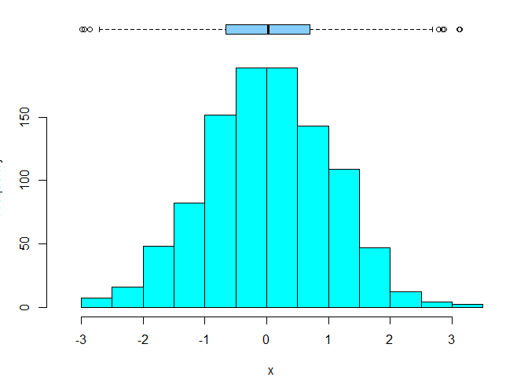

<!-- README.md is generated from README.Rmd. Please edit that file -->

# Rcoisas

<!-- badges: start -->
<!-- badges: end -->

> Funções para aulas e apresentação de resultados em português.

O pacote contém 15 funções, incluídas algumas importadas do pacote
[`csapAIH`](https://github.com/fulvionedel/csapAIH)), principalmente
para a descrição de variáveis com ‘output’ em português, e trabalhar com
populações brasileiras .

### Funções no pacote `Rcoisas`

     [1] "POPBR12                 População brasileira"                             
     [2] "RDRS2019                Arquivos da AIH"                                  
     [3] "bolero                  Bolero: tabelas 2x2"                              
     [4] "demonstra_IC            Demonstração do intervalo de confiança"           
     [5] "descreve                Descreve uma variável numérica"                   
     [6] "formatL                 Números em formato latino"                        
     [7] "fxetar.det_pra_fxetar5"                                                   
     [8] "                        Transforma a \"faixa etária detalhada\" (DATASUS)"
     [9] "                        em 17 faixas quinquenais."                        
    [10] "ggplot_pir              Pirâmides populacionais"                          
    [11] "histobox                Histograma com boxplot"                           
    [12] "obitosRS2019            Registros de óbito"                               
    [13] "plot.histobox           Método para histobox"                             
    [14] "plotZ                   Gráfico da probababilidade de pertencer a uma"    
    [15] "                        área da curva Normal"                             
    [16] "plot_pir                Pirâmides populacionais com os arquivos de"       
    [17] "                        população disponibilizados pelo DATASUS"          
    [18] "print.descreve          Imprime o resultado da função 'descreve'"         
    [19] "tabuleiro               Tabela de frequências univariada"                 
    [20] "tabuleiro2              Tabela de frequências com separadores latinos"    

## Instalação

O pacote ainda não tem uma primeira versão para ser lançada. A versão de
desenvolvimento pode ser instalada a partir do
[GitHub](https://github.com/) com:

``` r
# install.packages("remotes") # Se for necessário
remotes::install_github("fulvionedel/Rcoisas")
```

## Exemplos

``` r
library(Rcoisas)
obitos <- obitosRS2019[c("sexo", "idade", "RACACOR", "CAUSABAS")]
cardio <- grepl("circulatório", csapAIH::cid10cap(obitos$CAUSABAS)) |>
  factor(levels = c(TRUE, FALSE), labels = c("sim", "não"))
externas <- grepl("externas", csapAIH::cid10cap(obitos$CAUSABAS)) |>
  factor(levels = c(TRUE, FALSE), labels = c("sim", "não"))

bolero(obitos$sexo, cardio)
#> =============================================================
#>                   Tabela 2 por 2 
#>         bolero(independente, dependente, dec=2, dnn) 
#> ------------------------------------------------------------- 
#> Var. dependente : cardio = sim 
#> Var. independente: obitos.sexo = fem 
#> 
#>            cardio
#> obitos$sexo sim não Sum
#>        fem  117 284 401
#>        masc 106 385 491
#>        Sum  223 669 892
#> 
#> Proporções (%)
#>            cardio
#> obitos$sexo  sim  não
#>        fem  29.2 70.8
#>        masc 21.6 78.4
#> 
#>   Razão de Probabilidades: 1.35 ; IC95% (assintótico): 1.08 1.70 
#>                                   IC95% (exato)      : 1.07 1.67
#>   Razão de Odds          : 1.50 ; IC95% (exato)      : 1.09 2.05
#>   Valor-p: Pearson, Yates: 0.012 ; Fisher: 0.01 
#> =============================================================
bolero(factor(obitos$sexo, levels = c("masc", "fem")), externas, dnn = c("sexo", "causas externas"))
#> =============================================================
#>                   Tabela 2 por 2 
#>         bolero(independente, dependente, dec=2, dnn) 
#> ------------------------------------------------------------- 
#> Var. dependente : causas.externas = sim 
#> Var. independente: sexo = masc 
#> 
#>       causas externas
#> sexo   sim não Sum
#>   masc  69 422 491
#>   fem   16 385 401
#>   Sum   85 807 892
#> 
#> Proporções (%)
#>       causas externas
#> sexo    sim  não
#>   masc 14.1 85.9
#>   fem   4.0 96.0
#> 
#>   Razão de Probabilidades: 3.52 ; IC95% (assintótico): 2.08 5.97 
#>                                   IC95% (exato)      : 2.11 5.88
#>   Razão de Odds          : 3.93 ; IC95% (exato)      : 2.21 7.38
#>   Valor-p: Pearson, Yates: <0,001 ; Fisher: <0,001 
#> =============================================================

demonstra_IC(rnorm(384), n = 50000, r = 100)
#> $mediapop
#> [1] -0.00793576
#> 
#> $medias
#>             media       liminf        limsup fora
#> 1   -0.0048342777 -0.013546542  0.0038779865    2
#> 2   -0.0133301839 -0.022111946 -0.0045484215    2
#> 3   -0.0046236448 -0.013382972  0.0041356825    2
#> 4   -0.0008305603 -0.009607878  0.0079467579    2
#> 5   -0.0107995691 -0.019535574 -0.0020635641    2
#> 6   -0.0058445958 -0.014624132  0.0029349401    2
#> 7   -0.0079427227 -0.016654719  0.0007692742    2
#> 8   -0.0104178297 -0.019154799 -0.0016808609    2
#> 9   -0.0105658700 -0.019334780 -0.0017969595    2
#> 10  -0.0125870863 -0.021354121 -0.0038200513    2
#> 11  -0.0129196660 -0.021664778 -0.0041745542    2
#> 12  -0.0058205154 -0.014564674  0.0029236436    2
#> 13   0.0053922004 -0.003352514  0.0141369153    1
#> 14  -0.0067761905 -0.015554282  0.0020019011    2
#> 15  -0.0158125098 -0.024564409 -0.0070606101    2
#> 16  -0.0168730714 -0.025626558 -0.0081195844    1
#> 17  -0.0184032282 -0.027145049 -0.0096614077    1
#> 18  -0.0090473319 -0.017805583 -0.0002890808    2
#> 19  -0.0006304218 -0.009380871  0.0081200279    2
#> 20  -0.0083824439 -0.017148739  0.0003838509    2
#> 21  -0.0137123219 -0.022445671 -0.0049789724    2
#> 22  -0.0061622208 -0.014948959  0.0026245176    2
#> 23  -0.0164941357 -0.025287069 -0.0077012027    2
#> 24  -0.0046443893 -0.013422708  0.0041339294    2
#> 25  -0.0247990803 -0.033567484 -0.0160306770    1
#> 26  -0.0115207242 -0.020298737 -0.0027427114    2
#> 27  -0.0124557230 -0.021234968 -0.0036764783    2
#> 28   0.0021088619 -0.006666480  0.0108842042    1
#> 29   0.0007181638 -0.007986213  0.0094225409    2
#> 30  -0.0148680905 -0.023609801 -0.0061263803    2
#> 31  -0.0037027171 -0.012459536  0.0050541017    2
#> 32  -0.0075345493 -0.016268984  0.0011998857    2
#> 33  -0.0117019263 -0.020446869 -0.0029569832    2
#> 34  -0.0020818895 -0.010872485  0.0067087060    2
#> 35   0.0015376657 -0.007206799  0.0102821302    1
#> 36  -0.0052147123 -0.013954440  0.0035250151    2
#> 37  -0.0126547882 -0.021439993 -0.0038695830    2
#> 38  -0.0101860215 -0.018933474 -0.0014385690    2
#> 39  -0.0136868884 -0.022460685 -0.0049130919    2
#> 40  -0.0061961730 -0.014912912  0.0025205657    2
#> 41  -0.0098887963 -0.018625022 -0.0011525712    2
#> 42  -0.0150934303 -0.023831673 -0.0063551877    2
#> 43  -0.0057973700 -0.014549331  0.0029545914    2
#> 44  -0.0062348841 -0.014992113  0.0025223451    2
#> 45  -0.0075942375 -0.016340855  0.0011523799    2
#> 46  -0.0093138866 -0.018115506 -0.0005122676    2
#> 47  -0.0012611633 -0.010041776  0.0075194493    2
#> 48  -0.0113068432 -0.020051084 -0.0025626027    2
#> 49  -0.0027325519 -0.011491318  0.0060262144    2
#> 50  -0.0123372710 -0.021117190 -0.0035573526    2
#> 51  -0.0071457864 -0.015983689  0.0016921161    2
#> 52   0.0045579655 -0.004218785  0.0133347157    1
#> 53  -0.0144489093 -0.023174843 -0.0057229758    2
#> 54   0.0019539670 -0.006819622  0.0107275564    1
#> 55  -0.0057944048 -0.014521165  0.0029323556    2
#> 56  -0.0170594655 -0.025787883 -0.0083310479    1
#> 57  -0.0145046077 -0.023265389 -0.0057438262    2
#> 58  -0.0101719109 -0.018917548 -0.0014262740    2
#> 59  -0.0086268255 -0.017360378  0.0001067266    2
#> 60  -0.0035537251 -0.012279159  0.0051717088    2
#> 61  -0.0058088087 -0.014568510  0.0029508928    2
#> 62  -0.0117697005 -0.020583916 -0.0029554855    2
#> 63  -0.0192057224 -0.027942758 -0.0104686873    1
#> 64  -0.0128772368 -0.021666878 -0.0040875957    2
#> 65  -0.0082251487 -0.016991607  0.0005413096    2
#> 66  -0.0072677235 -0.015977747  0.0014423005    2
#> 67  -0.0112616034 -0.020012750 -0.0025104567    2
#> 68  -0.0125535142 -0.021315018 -0.0037920100    2
#> 69  -0.0006852151 -0.009483633  0.0081132033    2
#> 70  -0.0088677957 -0.017630152 -0.0001054396    2
#> 71  -0.0116479316 -0.020450483 -0.0028453800    2
#> 72  -0.0101820328 -0.018934488 -0.0014295778    2
#> 73  -0.0024588630 -0.011175065  0.0062573389    2
#> 74  -0.0019716804 -0.010757834  0.0068144737    2
#> 75   0.0038394331 -0.004951824  0.0126306897    1
#> 76  -0.0072267657 -0.016012691  0.0015591598    2
#> 77  -0.0114176449 -0.020220222 -0.0026150679    2
#> 78  -0.0109852895 -0.019772595 -0.0021979844    2
#> 79  -0.0035659590 -0.012290000  0.0051580819    2
#> 80  -0.0064362385 -0.015149244  0.0022767670    2
#> 81  -0.0123842165 -0.021144710 -0.0036237230    2
#> 82  -0.0109330739 -0.019674137 -0.0021920106    2
#> 83  -0.0022023756 -0.010931165  0.0065264135    2
#> 84  -0.0079354882 -0.016716060  0.0008450836    2
#> 85  -0.0108078667 -0.019561463 -0.0020542701    2
#> 86  -0.0082764752 -0.017031985  0.0004790350    2
#> 87  -0.0099784293 -0.018821639 -0.0011352198    2
#> 88  -0.0055387273 -0.014305734  0.0032282791    2
#> 89  -0.0149016882 -0.023662171 -0.0061412056    2
#> 90  -0.0163907850 -0.025099902 -0.0076816681    2
#> 91  -0.0124488247 -0.021147865 -0.0037497846    2
#> 92  -0.0076890162 -0.016471946  0.0010939132    2
#> 93  -0.0028450161 -0.011630127  0.0059400949    2
#> 94  -0.0145064470 -0.023259470 -0.0057534242    2
#> 95  -0.0099829010 -0.018760704 -0.0012050983    2
#> 96  -0.0079618352 -0.016710290  0.0007866198    2
#> 97  -0.0068511228 -0.015612637  0.0019103908    2
#> 98  -0.0079335917 -0.016702070  0.0008348862    2
#> 99  -0.0061674633 -0.014925342  0.0025904156    2
#> 100 -0.0100122089 -0.018793688 -0.0012307303    2
#> 
#> $grafico
```


    #> 
    #> $teste.t
    #> 
    #>  One Sample t-test
    #> 
    #> data:  medias
    #> t = 11.127, df = 399, p-value < 2.2e-16
    #> alternative hypothesis: true mean is not equal to 0
    #> 95 percent confidence interval:
    #>  0.3837852 0.5485102
    #> sample estimates:
    #> mean of x 
    #> 0.4661477

    descreve(rnorm(1000))


    #> rnorm(1000) :  1000  observações 
    #> 
    #> Válidos: 1000     Missings: 0     Soma: -49.25 
    #> Menor: -3.42  Maior: 2.68     Amplitude: 6.1
    #> Média: -0.05  DP: 1.02    CV(%): 2073.15
    #> Assimetria: -0.16     Curtose(real): 3.01
    #> Quantis:
    #>  2.5%    5%   25%   50%   75%   95% 97.5% 
    #> -2.10 -1.73 -0.75 -0.04  0.64  1.58  1.85 
    #>        IIQ: 1.38
    histobox(rnorm(1000))



``` r
dev.off()
#> null device 
#>           1
```

<!-- You'll still need to render `README.Rmd` regularly, to keep `README.md` up-to-date. `devtools::build_readme()` is handy for this. You could also use GitHub Actions to re-render `README.Rmd` every time you push. An example workflow can be found here: <https://github.com/r-lib/actions/tree/v1/examples>. -->
