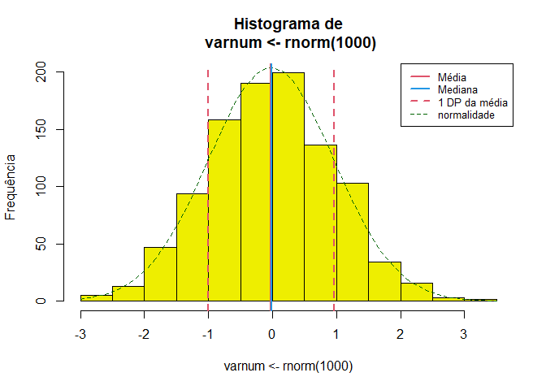
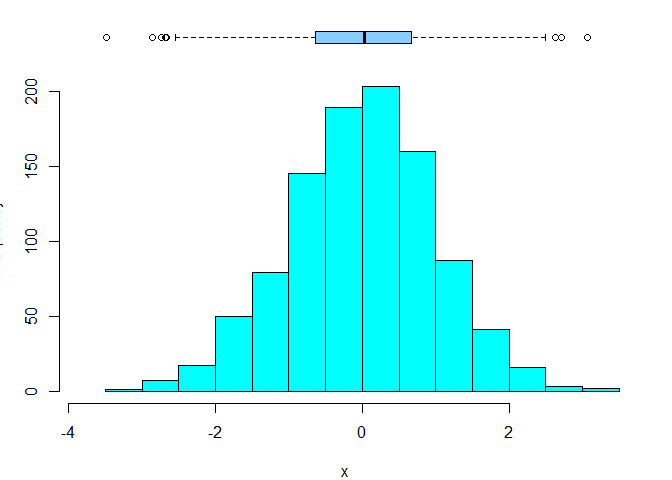
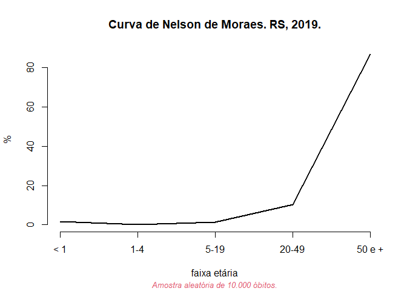

Rcoisas
================

- [Instalação](#instalação)
- [Exemplos](#exemplos)
  - [Descrição univariada](#descrição-univariada)
    - [Variáveis numéricas](#variáveis-numéricas)
    - [Variáveis categóricas](#variáveis-categóricas)
  - [Curva de Nelson de Moraes](#curva-de-nelson-de-moraes)
  - [Tabelas 2 x 2](#tabelas-2-x-2)

<!-- README.md is generated from README.Rmd. Please edit that file -->
<!-- badges: start -->
<!-- badges: end -->

> **Funções para aulas e apresentação de resultados em português.**

O pacote contém funções com *outputs* em português e bancos de dados
úteis para a produção de gráficos e tabelas para aulas, como a descrição
“completa” de uma variável numérica, uma tabela de frequências, a
análise de uma tabela 2 x 2 ou a construção de indicadores de saúde,
como a curva de Nelson de Moraes.
<!-- Algumas funções são importadas do pacote [`csapAIH`](https://github.com/fulvionedel/csapAIH) (`fxetar_quinq`, `fxetar3g`, `ufbr`, `ler_popbr` e `popbr2000_2021`).  -->
Veja a ajuda para a lista completa e detalhamento das funções e bancos
de dados no pacote.

# Instalação

O pacote ainda não tem uma primeira versão para ser lançada. A versão de
desenvolvimento pode ser instalada a partir do
[GitHub](https://github.com/) com o pacote `remotes`:

    # install.packages("remotes") # Se o pacote 'remotes' não estiver instalado
    remotes::install_github("fulvionedel/Rcoisas")

# Exemplos

``` r
library(Rcoisas)
```

## Descrição univariada

> Funções `descreve`, `histobox` e `tabuleiro`.

    descreve(x, by = NULL, dec = 2, na.rm = TRUE, data = NULL, histograma = TRUE, breaks = "Sturges", freq = TRUE, main = NULL, xlab = NULL, ylab = NULL, linhas = 2, curva = TRUE, densidade = FALSE, col.dens = 1, col = "yellow2", col.curva = "DarkGreen", col.media = 2, col.dp = col.media, col.mediana = 4, legenda = TRUE, lugar = "topright", lty.curva = 2, lwd.curva = 1, lty.dens = 3, lwd.dens = 2, lty = NULL, lwd = NULL, cex = NULL, print = "output", soma

### Variáveis numéricas

**A função `descreve`** realiza a descrição “completa” de uma variável
numérica. Por padrão apresenta uma lista com os parâmetros descritos e
um histograma com marcas da distribuição da variável. O histograma pode
ser suprimido e a lista pode ser transformada em `data.frame`.

``` r
set.seed(1)
descreve(varnum <- rnorm(1000))  
```




     varnum <- rnorm(1000) :  1000  observações 

    Válidos: 1000    Missings: 0 
    Menor: -3.01     Maior: 3.81     Amplitude: 6.82
    Média: -0.01     DP: 1.03    CV(%): 8884.81
    Assimetria: -0.02    Curtose(real): 2.99
    Quantis:
     2.5%    5%   25%   50%   75%   95% 97.5% 
    -2.13 -1.73 -0.70 -0.04  0.69  1.74  2.01 
              IIQ: 1.39 

    descreve(varnum, histograma = FALSE, print = "tabela")
                varnum
    n          1000.00
    Válidos    1000.00
    Missings      0.00
    Menor        -3.01
    Maior         3.81
    Amplitude     6.82
    Média        -0.01
    Variância     1.07
    DP            1.03
    CV(%)      8884.81
    Assimetria   -0.02
    Curtose       2.99
    P2.5         -2.13
    P5           -1.73
    P25          -0.70
    P50          -0.04
    P75           0.69
    P95           1.74
    P97.5         2.01
    IIQ           1.39

O output pode ser guardado em um objeto e depois impresso como lista ou
como tabela (de classe `data.frame`) e usado para captar em texto cada
parâmetro isoladamente.

``` r
x <- descreve(varnum, histograma = FALSE, print = FALSE)
Rcoisas:::print.descreve(x)

 varnum :  1000  observações 

Válidos: 1000    Missings: 0 
Menor: -3.01     Maior: 3.81     Amplitude: 6.82
Média: -0.01     DP: 1.03    CV(%): 8884.81
Assimetria: -0.02    Curtose(real): 2.99
Quantis:
 2.5%    5%   25%   50%   75%   95% 97.5% 
-2.13 -1.73 -0.70 -0.04  0.69  1.74  2.01 
          IIQ: 1.39 

Rcoisas:::print.descreve(x, print = "tabela")
            varnum
n          1000.00
Válidos    1000.00
Missings      0.00
Menor        -3.01
Maior         3.81
Amplitude     6.82
Média        -0.01
Variância     1.07
DP            1.03
CV(%)      8884.81
Assimetria   -0.02
Curtose       2.99
P2.5         -2.13
P5           -1.73
P25          -0.70
P50          -0.04
P75           0.69
P95           1.74
P97.5         2.01
IIQ           1.39

paste("Média de", x$media, "e desvio-padrão de", x$dp, "unidades, configurando um coeficiente de variação de", x$cv, "%.")
[1] "Média de -0.01 e desvio-padrão de 1.03 unidades, configurando um coeficiente de variação de 8884.81 %."
```

O objeto pode ser modificado para sua impressão. O exemplo a seguir usa
outra função do pacote, `formatL()`, para apresentar os valores em
formato latino.

``` r
Rcoisas:::print.descreve(x, print = "tabela") |> 
  tibble::as_tibble(rownames = "parametro") |>
  dplyr::mutate(varnum = formatL(varnum, format = "fg", digits = 3)) |>
  knitr::kable(align = 'r')
```

|  parametro | varnum |
|-----------:|-------:|
|          n |  1.000 |
|    Válidos |  1.000 |
|   Missings |      0 |
|      Menor |  -3,01 |
|      Maior |   3,81 |
|  Amplitude |   6,82 |
|      Média |  -0,01 |
|  Variância |   1,07 |
|         DP |   1,03 |
|      CV(%) |  8.885 |
| Assimetria |  -0,02 |
|    Curtose |   2,99 |
|       P2.5 |  -2,13 |
|         P5 |  -1,73 |
|        P25 |   -0,7 |
|        P50 |  -0,04 |
|        P75 |   0,69 |
|        P95 |   1,74 |
|      P97.5 |   2,01 |
|        IIQ |   1,39 |

O formato em tabela é pensado para uma análise estratificada por
categorias de um fator. Um argumento `by` está em desenvolvimento e
ainda não funciona adequadamente. 😕

**A função `histobox`** desenha um histograma com um diagrama de caixas
(“*box-plot*”) horizontal acima do gráfico.

``` r
histobox(varnum, col.h = "tomato", col.bx = "yellow", xlab = "Medida", ylab = "Frequência")
```



### Variáveis categóricas

**As funções `tabuleiro` e `tabuleiro2`** apresentam uma tabela
univariada com frequências absolutas e relativas (%) simples e
acumuladas.

    tabuleiro(x, digits = 1, total = TRUE, cum = TRUE, format = "en", data = NULL, ...)
    tabuleiro2(varcat, digits = 1)

``` r
tabuleiro(RACACOR, data = obitosRS2019)
         Freq     % Freq.acum %acum
Amarela    15   0.2        15   0.2
Branca   8517  88.0      8532  88.2
Indígena   17   0.2      8549  88.4
Parda     570   5.9      9119  94.3
Preta     554   5.7      9673 100.0
Total    9673 100.0      9673 100.0
```

Uma tabela para apresentação pode ser feita com a função `kable{knitr}`.
Esta função tem argumentos para apresentar resultados em formato latino,
mas o trabalho pode ser abreviado com a função `formatL{Rcoisas}` –
enquanto o argumento `format` não é implementado. Além disso, a
frequência acumulada aqui não faz muito sentido.

``` r
tab1 <- tabuleiro(RACACOR, data = obitosRS2019, cum = FALSE, digits = 3)
knitr::kable(tab1 |> formatL(format = "fg"), align = 'r')
```

|          |   Freq |   % |
|:---------|-------:|----:|
| Amarela  |     15 | 0,2 |
| Branca   |  8.517 |  88 |
| Indígena |     17 | 0,2 |
| Parda    |    570 |   6 |
| Preta    |    554 |   6 |
| Total    | 10.000 | 100 |

A função foi criada para oferecer axs estudantes um modo fácil de criar
no R uma tabela com essas características e valores em formato latino.
Na sua primeira versão os valores eram pré-formatados, oferecendo a
seguinte tabela:

``` r
(tab2 <- tabuleiro2(obitosRS2019$RACACOR))
              Freq     %(+NA) % válido % acum
Amarela       "    15" "0,1"  "0,2"    "0,2" 
Branca        " 8.517" "85,2" "88,0"   "88,2"
Indígena      "    17" "0,2"  "0,2"    "88,4"
Parda         "   570" "5,7"  "5,9"    "94,3"
Preta         "   554" "5,5"  "5,7"    "100" 
Total válidos " 9.673" "96,7" "100"    "˗"   
Missing       "   327" "3,3"  "˗"      "˗"   
Total         "10.000" "100"  "˗"      "˗"   
```

que pode facilmente formatada com `kable`.

``` r
knitr::kable(tab2, align = 'r')
```

|               |   Freq | %(+NA) | % válido | % acum |
|:--------------|-------:|-------:|---------:|-------:|
| Amarela       |     15 |    0,1 |      0,2 |    0,2 |
| Branca        |  8.517 |   85,2 |     88,0 |   88,2 |
| Indígena      |     17 |    0,2 |      0,2 |   88,4 |
| Parda         |    570 |    5,7 |      5,9 |   94,3 |
| Preta         |    554 |    5,5 |      5,7 |    100 |
| Total válidos |  9.673 |   96,7 |      100 |      ˗ |
| Missing       |    327 |    3,3 |        ˗ |      ˗ |
| Total         | 10.000 |    100 |        ˗ |      ˗ |

Mas os valores da tabela estão em formato caractere e não numérico, o
que impede a execução de operações matemáticas. Por isso foi rebatizada
de `tabuleiro2` e seu desenvolvimento descontinuado. Está no pacote
porque ainda a tenho em várias aulas 😪. É desaconselhável seu uso em
novos scripts.

## Curva de Nelson de Moraes

    fxetarNM(idade = NULL, fxetardet = NULL,

**A função `fxetarNM`** agrega um vetor com a idade ou com a “faixa
etária detalhada” (classificação do DATASUS) segundo as categorias da
Curva de Nelson de Moraes (\< 1, 1-4, 5-19, 20-49, 50 e +). O argumento
`grafico = TRUE` desenha o gráfico da curva.

``` r
fxetarNM(obitosRS2019$idade, grafico = TRUE, 
         col.sub = 2, font.sub = 3, cex.sub = .8, 
         main = "Curva de Nelson de Moraes. RS, 2019.", 
         sub = "\nAmostra aleatória de 10.000 óbitos.") 
```



Neste caso interessam as frequências acumuladas:

``` r
obitosRS2019$idade |>
  fxetarNM() |>
  tabuleiro(total = FALSE) |>
  formatL(format = "fg", digits = 2) |> 
  knitr::kable(align = 'r')
```

|        |  Freq |   % | Freq.acum | %acum |
|:-------|------:|----:|----------:|------:|
| \< 1   |   156 | 1,6 |       156 |   1,6 |
| 1-4    |    29 | 0,3 |       185 |   1,9 |
| 5-19   |   130 | 1,3 |       315 |   3,2 |
| 20-49  | 1.090 |  11 |     1.405 |    14 |
| 50 e + | 8.588 |  86 |    10.000 |   100 |

## Tabelas 2 x 2

**A função `bolero`** analisa a tabela de contingências de duas
variáveis dicotômicas. O exemplo a seguir usa um banco de dados do
pacote Rcoisas, com uma amostra aleatória de dez mil registros de óbitos
do RS para comparar a probabilidade de um diagnóstico de causa
cardiovascular e de causa externa segundo o sexo, entre os óbitos. As
causas são classificadas com a função `cid10cap()`, do pacote
[`csapAIH`](https://github.com/fulvionedel/csapAIH).

``` r
obitos <- obitosRS2019[c("sexo", "idade", "RACACOR", "CAUSABAS")]
cardio <- grepl("circulatório", csapAIH::cid10cap(obitos$CAUSABAS)) |>
  factor(levels = c(TRUE, FALSE), labels = c("sim", "não"))
externas <- grepl("externas", csapAIH::cid10cap(obitos$CAUSABAS)) |>
  factor(levels = c(TRUE, FALSE), labels = c("sim", "não"))

tabolero <- bolero(obitos$sexo, cardio)
===============================================================
                  Tabela 2 por 2 
        bolero(independente, dependente, dec=2, dnn) 
--------------------------------------------------------------- 
Var. dependente : cardio = sim 
Var. independente: obitos.sexo = fem 
Missings: 1 (0,0%)

           cardio
obitos$sexo  sim  não  Sum
       fem  1197 3448 4645
       masc 1259 4095 5354
       Sum  2456 7543 9999

Proporções (%)
           cardio
obitos$sexo  sim  não
       fem  25.8 74.2
       masc 23.5 76.5

Razão de Probabilidades: 1.10 ; IC95% (assintótico): 1.02 1.17 
                                 IC95% (exato)      : 1.02 1.17
Razão de Odds          : 1.13 ; IC95% (exato)      : 1.03 1.24
Valor-p: Pearson, Yates: 0.01 ; Fisher: 0.009 
===============================================================
```

Para mudar a categoria de referência mudam-se antes os níveis da
variável. Os rótulos dos nomes das variáveis podem ser modificados com o
argumento `dnn`.

``` r
bolero(factor(obitos$sexo, levels = c("masc", "fem")), externas, 
       dnn = c("sexo", "causas externas"))
===============================================================
                  Tabela 2 por 2 
        bolero(independente, dependente, dec=2, dnn) 
--------------------------------------------------------------- 
Var. dependente : causas.externas = sim 
Var. independente: sexo = masc 
Missings: 1 (0,0%)

      causas externas
sexo    sim  não  Sum
  masc  683 4671 5354
  fem   206 4439 4645
  Sum   889 9110 9999

Proporções (%)
      causas externas
sexo    sim  não
  masc 12.8 87.2
  fem   4.4 95.6

Razão de Probabilidades: 2.88 ; IC95% (assintótico): 2.47 3.34 
                                 IC95% (exato)      : 2.49 3.32
Razão de Odds          : 3.15 ; IC95% (exato)      : 2.68 3.72
Valor-p: Pearson, Yates: <0,001 ; Fisher: <0,001 
===============================================================
```

`bolero` foi escrita há mais de 20 anos e não pode ser impressa com
`kable`, mas os elementos de seu output podem ser recuperados. Veja a
estrutura de seu resultado:

``` r
# Note que acima foi criado o objeto 'tabolero' 
str(tabolero)
List of 14
 $ tab     : 'table' int [1:2, 1:2] 1197 1259 3448 4095
  ..- attr(*, "dimnames")=List of 2
  .. ..$ obitos$sexo: chr [1:2] "fem" "masc"
  .. ..$ cardio     : chr [1:2] "sim" "não"
 $ proptab : 'table' num [1:2, 1:2] 25.8 23.5 74.2 76.5
  ..- attr(*, "dimnames")=List of 2
  .. ..$ obitos$sexo: chr [1:2] "fem" "masc"
  .. ..$ cardio     : chr [1:2] "sim" "não"
 $ RP      : num 1.1
 $ lci.rp  : num 1.02
 $ uci.rp  : num 1.17
 $ OR      : num 1.13
 $ or.ic   : num [1:2] 1.03 1.24
  ..- attr(*, "conf.level")= num 0.95
 $ lci.or  : num 1.03
 $ uci.or  : num 1.24
 $ ft      :List of 7
  ..$ p.value    : num 0.0091
  ..$ conf.int   : num [1:2] 1.03 1.24
  .. ..- attr(*, "conf.level")= num 0.95
  ..$ estimate   : Named num 1.13
  .. ..- attr(*, "names")= chr "odds ratio"
  ..$ null.value : Named num 1
  .. ..- attr(*, "names")= chr "odds ratio"
  ..$ alternative: chr "two.sided"
  ..$ method     : chr "Fisher's Exact Test for Count Data"
  ..$ data.name  : chr "tab"
  ..- attr(*, "class")= chr "htest"
 $ qui2    :List of 9
  ..$ statistic: Named num 6.7
  .. ..- attr(*, "names")= chr "X-squared"
  ..$ parameter: Named int 1
  .. ..- attr(*, "names")= chr "df"
  ..$ p.value  : num 0.00963
  ..$ method   : chr "Pearson's Chi-squared test with Yates' continuity correction"
  ..$ data.name: chr "tab"
  ..$ observed : 'table' int [1:2, 1:2] 1197 1259 3448 4095
  .. ..- attr(*, "dimnames")=List of 2
  .. .. ..$ obitos$sexo: chr [1:2] "fem" "masc"
  .. .. ..$ cardio     : chr [1:2] "sim" "não"
  ..$ expected : num [1:2, 1:2] 1141 1315 3504 4039
  .. ..- attr(*, "dimnames")=List of 2
  .. .. ..$ obitos$sexo: chr [1:2] "fem" "masc"
  .. .. ..$ cardio     : chr [1:2] "sim" "não"
  ..$ residuals: 'table' num [1:2, 1:2] 1.66 -1.546 -0.947 0.882
  .. ..- attr(*, "dimnames")=List of 2
  .. .. ..$ obitos$sexo: chr [1:2] "fem" "masc"
  .. .. ..$ cardio     : chr [1:2] "sim" "não"
  ..$ stdres   : 'table' num [1:2, 1:2] 2.61 -2.61 -2.61 2.61
  .. ..- attr(*, "dimnames")=List of 2
  .. .. ..$ obitos$sexo: chr [1:2] "fem" "masc"
  .. .. ..$ cardio     : chr [1:2] "sim" "não"
  ..- attr(*, "class")= chr "htest"
 $ p.qui2  : num 0.00963
 $ p.Fisher: num 0.0091
 $ resumo  : 'table' num [1, 1:4] 1.096 1.023 1.174 0.009
  ..- attr(*, "dimnames")=List of 2
  .. ..$ : chr "cardio"
  .. ..$ : chr [1:4] "RP" "IC95inf" "IC95sup" "p"
```

Assim podemos dizer, por exemplo, que a probabilidade de que a causa
básica de óbito seja cardiovascular é 10% maior no sexo feminino que no
masculino (RP = 1,10; IC<sub>95</sub> 1,02 a 1,17). Veja abaixo o código
utilizado:

> \[…\] a probabilidade de que a causa básica de óbito seja
> cardiovascular é `` `r formatL((tabolero$RP-1)*100, digits = 0)` ``%
> maior no sexo feminino que no masculino (RP =
> `` `r formatL(tabolero$RP, 2)` ``; IC<sub>95</sub>
> `` `r formatL(tabolero$lci.rp, 2)` `` a
> `` `r formatL(tabolero$uci.rp, 2)` ``).

<!-- You'll still need to render `README.Rmd` regularly, to keep `README.md` up-to-date. `devtools::build_readme()` is handy for this. You could also use GitHub Actions to re-render `README.Rmd` every time you push. An example workflow can be found here: <https://github.com/r-lib/actions/tree/v1/examples>. -->
