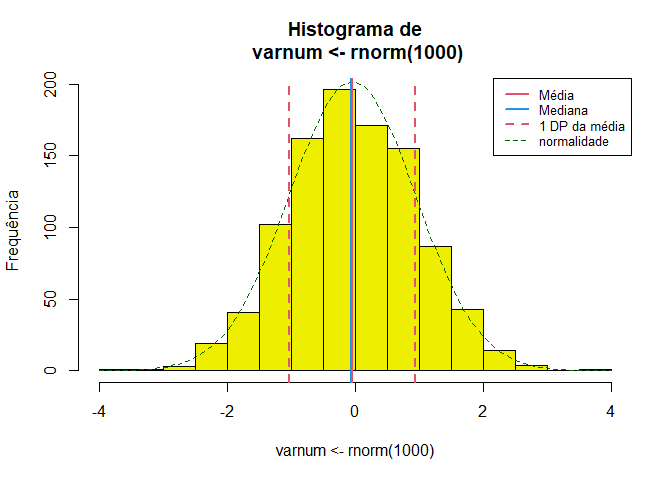

<!-- README.md is generated from README.Rmd. Please edit that file -->

# Rcoisas

<!-- badges: start -->
<!-- badges: end -->

> Funções para aulas e apresentação de resultados em português.

O pacote contém funções com *outputs* em português e bancos de dados
úteis para a produção de gráficos e tabelas para aulas, como a descrição
“completa” de uma variável numérica ou a construção de indicadores de
saúde. Algumas funções são importadas do pacote
[`csapAIH`](https://github.com/fulvionedel/csapAIH) (`fxetar_quinq`,
`fxetar3g`, `ufbr`, `ler_popbr`, e `popbr2000_2021`). Veja a ajuda para
a lista completa e detalhamento das funções e bancos de dados no pacote.

## Instalação

O pacote ainda não tem uma primeira versão para ser lançada. A versão de
desenvolvimento pode ser instalada a partir do
[GitHub](https://github.com/) com:

    # install.packages("remotes") # Se o pacote 'remotes' não estiver instalado
    remotes::install_github("fulvionedel/Rcoisas")

## Exemplos

``` r
library(Rcoisas)
```

### Descrição univariada

> Funções `descreve`, `histobox` e `tabuleiro`.

#### Variáveis numéricas

**A função `descreve`** realiza a descrição “completa” de uma variável
numérica. Por padrão apresenta uma lista com os parâmetros descritos e
um histograma com marcas da distribuição da variável. O histograma pode
ser suprimido e a lista pode ser transformada em `data.frame`.

``` r
descreve(varnum <- rnorm(1000))
```




     varnum <- rnorm(1000) :  1000  observações 

    Válidos: 1000    Missings: 0     Soma: -41.1 
    Menor: -3.76     Maior: 3.57     Amplitude: 7.34
    Média: -0.04     DP: 0.99    CV(%): 2415.61
    Assimetria: 0.01     Curtose(real): 3
    Quantis:
     2.5%    5%   25%   50%   75%   95% 97.5% 
    -1.97 -1.60 -0.76 -0.06  0.64  1.62  1.87 
              IIQ: 1.4 
    descreve(varnum, histograma = FALSE, print = "tabela")
                varnum
    n          1000.00
    Válidos    1000.00
    Missings      0.00
    Menor        -3.76
    Maior         3.57
    Amplitude     7.34
    Soma        -41.10
    Média        -0.04
    Variância     0.99
    DP            0.99
    CV(%)      2415.61
    Assimetria    0.01
    Curtose       3.00
    P2.5         -1.97
    P5           -1.60
    P25          -0.76
    P50          -0.06
    P75           0.64
    P95           1.62
    P97.5         1.87
    IIQ           1.40

O output pode ser guardado em um objeto e depois impresso como lista ou
como tabela (de classe `data.frame`) e usado para captar em texto cada
parâmetro isoladamente.

``` r
x <- descreve(varnum, histograma = FALSE, print = FALSE)
Rcoisas:::print.descreve(x)

 varnum :  1000  observações 

Válidos: 1000    Missings: 0     Soma: -41.1 
Menor: -3.76     Maior: 3.57     Amplitude: 7.34
Média: -0.04     DP: 0.99    CV(%): 2415.61
Assimetria: 0.01     Curtose(real): 3
Quantis:
 2.5%    5%   25%   50%   75%   95% 97.5% 
-1.97 -1.60 -0.76 -0.06  0.64  1.62  1.87 
          IIQ: 1.4 
Rcoisas:::print.descreve(x, print = "tabela")
            varnum
n          1000.00
Válidos    1000.00
Missings      0.00
Menor        -3.76
Maior         3.57
Amplitude     7.34
Soma        -41.10
Média        -0.04
Variância     0.99
DP            0.99
CV(%)      2415.61
Assimetria    0.01
Curtose       3.00
P2.5         -1.97
P5           -1.60
P25          -0.76
P50          -0.06
P75           0.64
P95           1.62
P97.5         1.87
IIQ           1.40
paste("Média de", x$media, "e desvio-padrão de", x$dp, "unidades, configurando um coeficiente de variação de", x$cv, "%.")
[1] "Média de -0.04 e desvio-padrão de 0.99 unidades, configurando um coeficiente de variação de 2415.61 %."
```

O objeto pode ser modificado para sua impressão. O exemplo a seguir usa
outra função do pacote, `formatL()` para apresentar os valores em
formato latino.

``` r
Rcoisas:::print.descreve(x, print = "tabela") |> 
  tibble::as_tibble(rownames = "parametro") |>
  dplyr::mutate(varnum = formatL(varnum, format = "fg", digits = 3)) |>
  knitr::kable()
```

| parametro  | varnum |
|:-----------|:-------|
| n          | 1.000  |
| Válidos    | 1.000  |
| Missings   | 0      |
| Menor      | -3,76  |
| Maior      | 3,57   |
| Amplitude  | 7,34   |
| Soma       | -41,1  |
| Média      | -0,04  |
| Variância  | 0,99   |
| DP         | 0,99   |
| CV(%)      | 2.416  |
| Assimetria | 0,01   |
| Curtose    | 3      |
| P2.5       | -1,97  |
| P5         | -1,6   |
| P25        | -0,76  |
| P50        | -0,06  |
| P75        | 0,64   |
| P95        | 1,62   |
| P97.5      | 1,87   |
| IIQ        | 1,4    |

Um argumento `by`, para estratificação em categorias de um fator, está
em desenvolvimento e ainda não funciona adequadamente. 😕

**A função `histobox`** desenha um histograma com um *box-plot*
horizontal acima do gráfico.

``` r
histobox(varnum)
```


#### Variáveis categóricas

``` r
tabuleiro(obitosRS2019$RACACOR)
         Freq     % Freq.acum %acum
Amarela    12   0.1        12   0.1
Branca   8493  88.0      8505  88.1
Indígena   20   0.2      8525  88.3
Parda     555   5.7      9080  94.1
Preta     573   5.9      9653 100.0
Total    9653 100.0      9653 100.0

tabuleiro2(obitosRS2019$RACACOR)
              Freq     %(+NA) % válido % acum
Amarela       "    12" "0,1"  "0,1"    "0,1" 
Branca        " 8.493" "84,9" "88,0"   "88,1"
Indígena      "    20" "0,2"  "0,2"    "88,3"
Parda         "   555" "5,5"  "5,7"    "94,1"
Preta         "   573" "5,7"  "5,9"    "100" 
Total válidos " 9.653" "96,5" "100"    "˗"   
Missing       "   347" "3,5"  "˗"      "˗"   
Total         "10.000" "100"  "˗"      "˗"   
```

### Tabelas 2 $\times$ 2

``` r
obitos <- obitosRS2019[c("sexo", "idade", "RACACOR", "CAUSABAS")]
cardio <- grepl("circulatório", csapAIH::cid10cap(obitos$CAUSABAS)) |>
  factor(levels = c(TRUE, FALSE), labels = c("sim", "não"))
externas <- grepl("externas", csapAIH::cid10cap(obitos$CAUSABAS)) |>
  factor(levels = c(TRUE, FALSE), labels = c("sim", "não"))

bolero(obitos$sexo, cardio)
===============================================================
                  Tabela 2 por 2 
        bolero(independente, dependente, dec=2, dnn) 
--------------------------------------------------------------- 
Var. dependente : cardio = sim 
Var. independente: obitos.sexo = fem 

           cardio
obitos$sexo  sim  não  Sum
       fem  1248 3438 4686
       masc 1226 4086 5312
       Sum  2474 7524 9998

Proporções (%)
           cardio
obitos$sexo  sim  não
       fem  26.6 73.4
       masc 23.1 76.9

Razão de Probabilidades: 1.15 ; IC95% (assintótico): 1.08 1.24 
                                IC95% (exato)      : 1.08 1.23
Razão de Odds          : 1.21 ; IC95% (exato)      : 1.10 1.33
Valor-p: Pearson, Yates: <0,001 ; Fisher: <0,001 
===============================================================

bolero(factor(obitos$sexo, levels = c("masc", "fem")), externas, 
       dnn = c("sexo", "causas externas"))
===============================================================
                  Tabela 2 por 2 
        bolero(independente, dependente, dec=2, dnn) 
--------------------------------------------------------------- 
Var. dependente : causas.externas = sim 
Var. independente: sexo = masc 

      causas externas
sexo    sim  não  Sum
  masc  628 4684 5312
  fem   183 4503 4686
  Sum   811 9187 9998

Proporções (%)
      causas externas
sexo    sim  não
  masc 11.8 88.2
  fem   3.9 96.1

Razão de Probabilidades: 3.03 ; IC95% (assintótico): 2.58 3.55 
                                IC95% (exato)      : 2.60 3.53
Razão de Odds          : 3.30 ; IC95% (exato)      : 2.78 3.93
Valor-p: Pearson, Yates: <0,001 ; Fisher: <0,001 
===============================================================
```

<!-- You'll still need to render `README.Rmd` regularly, to keep `README.md` up-to-date. `devtools::build_readme()` is handy for this. You could also use GitHub Actions to re-render `README.Rmd` every time you push. An example workflow can be found here: <https://github.com/r-lib/actions/tree/v1/examples>. -->
