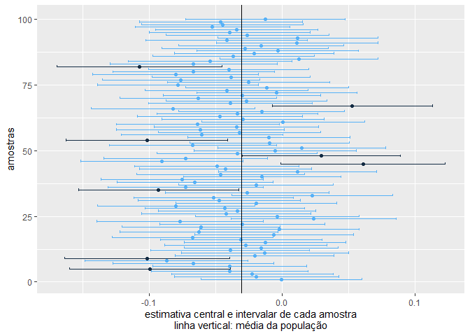
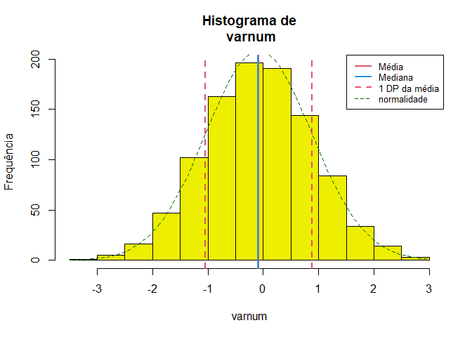
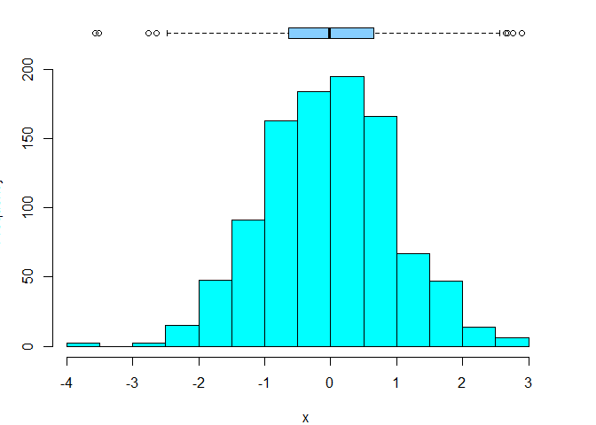

<!-- README.md is generated from README.Rmd. Please edit that file -->

# Rcoisas

<!-- badges: start -->
<!-- badges: end -->

> Funções para aulas e apresentação de resultados em português.

O pacote contém 15 funções, incluídas algumas importadas do pacote
[`csapAIH`](https://github.com/fulvionedel/csapAIH)), principalmente
para a descrição de variáveis com ‘output’ em português, e trabalhar com
populações brasileiras .

### Funções no pacote `Rcoisas`

     [1] "POPBR12                 População brasileira"                             
     [2] "RDRS2019                Arquivos da AIH"                                  
     [3] "bolero                  Bolero: tabelas 2x2"                              
     [4] "demonstra_IC            Demonstração do intervalo de confiança"           
     [5] "descreve                Descreve uma variável numérica"                   
     [6] "formatL                 Números em formato latino"                        
     [7] "fxetar.det_pra_fxetar5"                                                   
     [8] "                        Transforma a \"faixa etária detalhada\" (DATASUS)"
     [9] "                        em 17 faixas quinquenais."                        
    [10] "ggplot_pir              Pirâmides populacionais"                          
    [11] "histobox                Histograma com boxplot"                           
    [12] "obitosRS2019            Registros de óbito"                               
    [13] "plot.histobox           Método para histobox"                             
    [14] "plotZ                   Gráfico da probababilidade de pertencer a uma"    
    [15] "                        área da curva Normal"                             
    [16] "plot_pir                Pirâmides populacionais com os arquivos de"       
    [17] "                        população disponibilizados pelo DATASUS"          
    [18] "print.descreve          Imprime o resultado da função 'descreve'"         
    [19] "tabuleiro               Tabela de frequências univariada"                 
    [20] "tabuleiro2              Tabela de frequências com separadores latinos"    

## Instalação

O pacote ainda não tem uma primeira versão para ser lançada. A versão de
desenvolvimento pode ser instalada a partir do
[GitHub](https://github.com/) com:

``` r
# install.packages("remotes") # Se for necessário
remotes::install_github("fulvionedel/Rcoisas")
```

## Exemplos

``` r
library(Rcoisas)
```

### Tabelas 2 $\times$ 2

``` r
obitos <- obitosRS2019[c("sexo", "idade", "RACACOR", "CAUSABAS")]
cardio <- grepl("circulatório", csapAIH::cid10cap(obitos$CAUSABAS)) |>
  factor(levels = c(TRUE, FALSE), labels = c("sim", "não"))
externas <- grepl("externas", csapAIH::cid10cap(obitos$CAUSABAS)) |>
  factor(levels = c(TRUE, FALSE), labels = c("sim", "não"))

bolero(obitos$sexo, cardio)
#> =============================================================
#>                   Tabela 2 por 2 
#>         bolero(independente, dependente, dec=2, dnn) 
#> ------------------------------------------------------------- 
#> Var. dependente : cardio = sim 
#> Var. independente: obitos.sexo = fem 
#> 
#>            cardio
#> obitos$sexo sim não Sum
#>        fem  117 284 401
#>        masc 106 385 491
#>        Sum  223 669 892
#> 
#> Proporções (%)
#>            cardio
#> obitos$sexo  sim  não
#>        fem  29.2 70.8
#>        masc 21.6 78.4
#> 
#>   Razão de Probabilidades: 1.35 ; IC95% (assintótico): 1.08 1.70 
#>                                   IC95% (exato)      : 1.07 1.67
#>   Razão de Odds          : 1.50 ; IC95% (exato)      : 1.09 2.05
#>   Valor-p: Pearson, Yates: 0.012 ; Fisher: 0.01 
#> =============================================================
bolero(factor(obitos$sexo, levels = c("masc", "fem")), externas, dnn = c("sexo", "causas externas"))
#> =============================================================
#>                   Tabela 2 por 2 
#>         bolero(independente, dependente, dec=2, dnn) 
#> ------------------------------------------------------------- 
#> Var. dependente : causas.externas = sim 
#> Var. independente: sexo = masc 
#> 
#>       causas externas
#> sexo   sim não Sum
#>   masc  69 422 491
#>   fem   16 385 401
#>   Sum   85 807 892
#> 
#> Proporções (%)
#>       causas externas
#> sexo    sim  não
#>   masc 14.1 85.9
#>   fem   4.0 96.0
#> 
#>   Razão de Probabilidades: 3.52 ; IC95% (assintótico): 2.08 5.97 
#>                                   IC95% (exato)      : 2.11 5.88
#>   Razão de Odds          : 3.93 ; IC95% (exato)      : 2.21 7.38
#>   Valor-p: Pearson, Yates: <0,001 ; Fisher: <0,001 
#> =============================================================
```

### Demonstração do intervalo de confiança

``` r
demonstra_IC(rnorm(384), n = 50000, r = 100)
#> $mediapop
#> [1] 0.05869496
#> 
#> $medias
#>          media     liminf     limsup fora
#> 1   0.05377207 0.04475475 0.06278940    2
#> 2   0.06023134 0.05115622 0.06930645    2
#> 3   0.06134795 0.05234070 0.07035520    2
#> 4   0.05472144 0.04568310 0.06375979    2
#> 5   0.05251290 0.04346140 0.06156440    2
#> 6   0.05708298 0.04799022 0.06617575    2
#> 7   0.05868542 0.04957049 0.06780034    2
#> 8   0.06097060 0.05189745 0.07004374    2
#> 9   0.05438111 0.04530760 0.06345462    2
#> 10  0.05266903 0.04358422 0.06175384    2
#> 11  0.06885702 0.05978375 0.07793028    1
#> 12  0.06080131 0.05175809 0.06984452    2
#> 13  0.06607744 0.05702016 0.07513473    2
#> 14  0.05751510 0.04842624 0.06660396    2
#> 15  0.06445476 0.05537251 0.07353701    2
#> 16  0.05755203 0.04849175 0.06661232    2
#> 17  0.06061635 0.05146737 0.06976533    2
#> 18  0.06729954 0.05824051 0.07635857    2
#> 19  0.06160971 0.05253974 0.07067968    2
#> 20  0.05377320 0.04471706 0.06282934    2
#> 21  0.06143981 0.05238899 0.07049063    2
#> 22  0.05458392 0.04549121 0.06367663    2
#> 23  0.05616665 0.04706857 0.06526472    2
#> 24  0.05550517 0.04646332 0.06454701    2
#> 25  0.05978499 0.05073358 0.06883640    2
#> 26  0.05284069 0.04379396 0.06188741    2
#> 27  0.05352061 0.04446894 0.06257229    2
#> 28  0.05432268 0.04524463 0.06340073    2
#> 29  0.05140820 0.04237095 0.06044546    2
#> 30  0.05036703 0.04131013 0.05942393    2
#> 31  0.05445495 0.04538529 0.06352461    2
#> 32  0.05739749 0.04836088 0.06643411    2
#> 33  0.06416000 0.05509811 0.07322190    2
#> 34  0.05670552 0.04766716 0.06574388    2
#> 35  0.05483866 0.04576479 0.06391252    2
#> 36  0.05503000 0.04597571 0.06408429    2
#> 37  0.05781823 0.04876167 0.06687480    2
#> 38  0.05680080 0.04769882 0.06590278    2
#> 39  0.05983734 0.05078399 0.06889068    2
#> 40  0.06018328 0.05113927 0.06922729    2
#> 41  0.06290623 0.05383075 0.07198170    2
#> 42  0.05857298 0.04946700 0.06767896    2
#> 43  0.05734994 0.04828537 0.06641451    2
#> 44  0.06013979 0.05107449 0.06920509    2
#> 45  0.06352635 0.05444437 0.07260833    2
#> 46  0.06720641 0.05817109 0.07624172    2
#> 47  0.05996881 0.05089048 0.06904713    2
#> 48  0.05996418 0.05089409 0.06903427    2
#> 49  0.05107373 0.04199077 0.06015670    2
#> 50  0.05922264 0.05011889 0.06832639    2
#> 51  0.05879009 0.04970887 0.06787131    2
#> 52  0.06029861 0.05123865 0.06935858    2
#> 53  0.05160916 0.04254325 0.06067507    2
#> 54  0.05378402 0.04470617 0.06286186    2
#> 55  0.05847987 0.04942934 0.06753040    2
#> 56  0.06229551 0.05321851 0.07137252    2
#> 57  0.05589905 0.04683622 0.06496187    2
#> 58  0.06385370 0.05478708 0.07292032    2
#> 59  0.05761234 0.04848000 0.06674467    2
#> 60  0.05880360 0.04973822 0.06786898    2
#> 61  0.05677656 0.04771711 0.06583601    2
#> 62  0.06312156 0.05409193 0.07215118    2
#> 63  0.05723916 0.04818189 0.06629644    2
#> 64  0.06703236 0.05795592 0.07610880    2
#> 65  0.05922459 0.05011957 0.06832962    2
#> 66  0.05729690 0.04820512 0.06638869    2
#> 67  0.06730390 0.05823934 0.07636845    2
#> 68  0.05914261 0.05007012 0.06821510    2
#> 69  0.05797955 0.04899028 0.06696882    2
#> 70  0.06738781 0.05831785 0.07645778    2
#> 71  0.05821652 0.04915796 0.06727509    2
#> 72  0.05981740 0.05079335 0.06884145    2
#> 73  0.06138019 0.05234868 0.07041170    2
#> 74  0.05625922 0.04721894 0.06529950    2
#> 75  0.05211689 0.04313419 0.06109959    2
#> 76  0.06035885 0.05131205 0.06940565    2
#> 77  0.06769112 0.05855441 0.07682783    2
#> 78  0.05473896 0.04565803 0.06381990    2
#> 79  0.05532693 0.04626077 0.06439309    2
#> 80  0.05637938 0.04730919 0.06544957    2
#> 81  0.05059209 0.04146460 0.05971958    2
#> 82  0.05241152 0.04336413 0.06145890    2
#> 83  0.06406488 0.05498637 0.07314340    2
#> 84  0.05532794 0.04623343 0.06442245    2
#> 85  0.06392553 0.05489029 0.07296078    2
#> 86  0.05234629 0.04322316 0.06146942    2
#> 87  0.06470728 0.05561134 0.07380322    2
#> 88  0.05830529 0.04924009 0.06737049    2
#> 89  0.06152647 0.05243403 0.07061892    2
#> 90  0.06308189 0.05397941 0.07218438    2
#> 91  0.05930127 0.05018860 0.06841395    2
#> 92  0.05679756 0.04773523 0.06585988    2
#> 93  0.06091399 0.05179420 0.07003379    2
#> 94  0.06466804 0.05557700 0.07375908    2
#> 95  0.06434391 0.05523587 0.07345195    2
#> 96  0.05307787 0.04401461 0.06214113    2
#> 97  0.05742846 0.04839009 0.06646683    2
#> 98  0.06283483 0.05376685 0.07190282    2
#> 99  0.06278297 0.05367300 0.07189293    2
#> 100 0.05266980 0.04360393 0.06173568    2
#> 
#> $grafico
```



    #> 
    #> $teste.t
    #> 
    #>  One Sample t-test
    #> 
    #> data:  medias
    #> t = 12.911, df = 399, p-value < 2.2e-16
    #> alternative hypothesis: true mean is not equal to 0
    #> 95 percent confidence interval:
    #>  0.4590651 0.6239752
    #> sample estimates:
    #> mean of x 
    #> 0.5415201

### Descrição univariada

``` r
descreve(rnorm(1000))
```



    #> rnorm(1000) :  1000  observações 
    #> 
    #> Válidos: 1000     Missings: 0     Soma: 37.46 
    #> Menor: -4.19  Maior: 2.74     Amplitude: 6.94
    #> Média: 0.04   DP: 1   CV(%): 2674.87
    #> Assimetria: -0.09     Curtose(real): 3.1
    #> Quantis:
    #>  2.5%    5%   25%   50%   75%   95% 97.5% 
    #> -1.92 -1.59 -0.60  0.04  0.73  1.67  1.91 
    #>        IIQ: 1.32
    histobox(rnorm(1000))



``` r

tabuleiro(obitos$RACACOR)
#>       Freq     % Freq.acum %acum
#> 1      760  88.6       760  88.6
#> 2       45   5.2       805  93.8
#> 3        2   0.2       807  94.1
#> 4       49   5.7       856  99.8
#> 5        2   0.2       858 100.0
#> Total  858 100.0       858 100.0
tabuleiro2(obitos$RACACOR)
#>               Freq  %(+NA) % válido % acum
#> 1             "760" "85,2" "88,6"   "88,6"
#> 2             " 45" "5,0"  "5,2"    "93,8"
#> 3             "  2" "0,2"  "0,2"    "94,1"
#> 4             " 49" "5,5"  "5,7"    "99,8"
#> 5             "  2" "0,2"  "0,2"    "100" 
#> Total válidos "858" "96,2" "100"    "˗"   
#> Missing       " 34" "3,8"  "˗"      "˗"   
#> Total         "892" "100"  "˗"      "˗"
```

<!-- You'll still need to render `README.Rmd` regularly, to keep `README.md` up-to-date. `devtools::build_readme()` is handy for this. You could also use GitHub Actions to re-render `README.Rmd` every time you push. An example workflow can be found here: <https://github.com/r-lib/actions/tree/v1/examples>. -->
