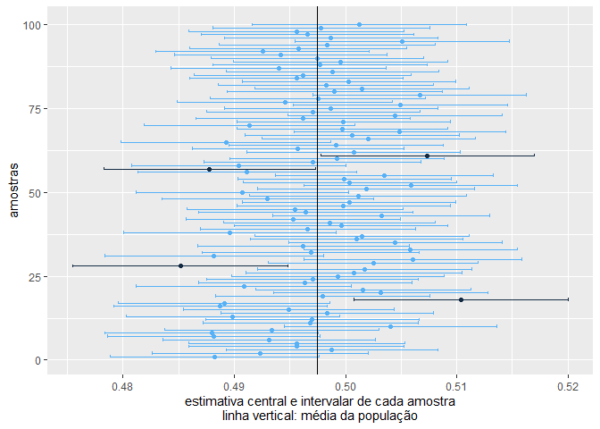
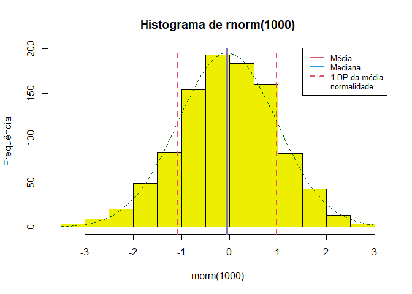

<!-- README.md is generated from README.Rmd. Please edit that file -->

# Rcoisas

<!-- badges: start -->
<!-- badges: end -->

> Funções para aulas e apresentação de resultados em português.

O pacote contém 15 funções, incluídas algumas importadas do pacote
[`csapAIH`](https://github.com/fulvionedel/csapAIH)), principalmente
para a descrição de variáveis com ‘output’ em português, e trabalhar com
populações brasileiras .

### Funções no pacote `Rcoisas`

     [1] "POPBR12                 População brasileira"                             
     [2] "RDRS2019                Arquivos da AIH"                                  
     [3] "bolero                  Bolero: tabelas 2x2"                              
     [4] "demonstra_IC            Demonstração do intervalo de confiança"           
     [5] "descreve                Descreve uma variável numérica"                   
     [6] "formatL                 Números em formato latino"                        
     [7] "fxetar.det_pra_fxetar5"                                                   
     [8] "                        Transforma a \"faixa etária detalhada\" (DATASUS)"
     [9] "                        em 17 faixas quinquenais."                        
    [10] "ggplot_pir              Pirâmides populacionais"                          
    [11] "histobox                Histograma com boxplot"                           
    [12] "obitosRS2019            Registros de óbito"                               
    [13] "plot.histobox           Método para histobox"                             
    [14] "plotZ                   Gráfico da probababilidade de pertencer a uma"    
    [15] "                        área da curva Normal"                             
    [16] "plot_pir                Pirâmides populacionais com os arquivos de"       
    [17] "                        população disponibilizados pelo DATASUS"          
    [18] "print.descreve          Imprime o resultado da função 'descreve'"         
    [19] "tabuleiro               Tabela de frequências univariada"                 
    [20] "tabuleiro2              Tabela de frequências com separadores latinos"    

## Instalação

O pacote ainda não tem uma primeira versão para ser lançada.

A versão de desenvolvimento pode ser instalada a partir do
[GitHub](https://github.com/) com:

``` r
# install.packages("remotes") # Se for necessário
remotes::install_github("fulvionedel/Rcoisas")
```

## Exemplos

``` r
library(Rcoisas)
## basic example code

demonstra_IC(runif(50), n = 3000, r = 100)
#> $mediapop
#> [1] 0.4974979
#> 
#> $medias
#>         media    liminf    limsup fora
#> 1   0.4882300 0.4788110 0.4976491    2
#> 2   0.4923405 0.4826321 0.5020489    2
#> 3   0.4987598 0.4892424 0.5082771    2
#> 4   0.4955839 0.4858979 0.5052700    2
#> 5   0.4956295 0.4859301 0.5053288    2
#> 6   0.4931422 0.4835741 0.5027103    2
#> 7   0.4881407 0.4786040 0.4976774    2
#> 8   0.4879654 0.4783558 0.4975750    2
#> 9   0.4933489 0.4837290 0.5029687    2
#> 10  0.5040470 0.4944863 0.5136077    2
#> 11  0.4968544 0.4871691 0.5065396    2
#> 12  0.4970209 0.4874189 0.5066229    2
#> 13  0.4898594 0.4802736 0.4994453    2
#> 14  0.4983476 0.4887784 0.5079168    2
#> 15  0.4949077 0.4854384 0.5043771    2
#> 16  0.4887450 0.4791283 0.4983617    2
#> 17  0.4890931 0.4795807 0.4986055    2
#> 18  0.5103986 0.5007361 0.5200612    1
#> 19  0.4979359 0.4883189 0.5075528    2
#> 20  0.5031866 0.4935675 0.5128058    2
#> 21  0.5015888 0.4919281 0.5112495    2
#> 22  0.4908543 0.4812096 0.5004990    2
#> 23  0.4963728 0.4867951 0.5059504    2
#> 24  0.4970560 0.4875520 0.5065600    2
#> 25  0.4992952 0.4897604 0.5088299    2
#> 26  0.5007780 0.4910734 0.5104826    2
#> 27  0.5017232 0.4921116 0.5113349    2
#> 28  0.4851558 0.4754571 0.4948545    1
#> 29  0.5024997 0.4930486 0.5119509    2
#> 30  0.5060591 0.4962305 0.5158876    2
#> 31  0.4881734 0.4783517 0.4979951    2
#> 32  0.4968909 0.4871385 0.5066434    2
#> 33  0.5058528 0.4962609 0.5154448    2
#> 34  0.4962240 0.4866940 0.5057540    2
#> 35  0.5044869 0.4948599 0.5141139    2
#> 36  0.5010085 0.4914524 0.5105646    2
#> 37  0.5014627 0.4918141 0.5111114    2
#> 38  0.4896059 0.4800280 0.4991838    2
#> 39  0.4966157 0.4869601 0.5062712    2
#> 40  0.4996172 0.4900333 0.5092012    2
#> 41  0.4985557 0.4890139 0.5080975    2
#> 42  0.4953101 0.4856667 0.5049536    2
#> 43  0.5032345 0.4934830 0.5129860    2
#> 44  0.4964023 0.4867612 0.5060435    2
#> 45  0.4954514 0.4857421 0.5051607    2
#> 46  0.4998082 0.4902146 0.5094018    2
#> 47  0.5003337 0.4907321 0.5099353    2
#> 48  0.4930030 0.4834710 0.5025350    2
#> 49  0.5011288 0.4913606 0.5108971    2
#> 50  0.4907520 0.4812003 0.5003037    2
#> 51  0.5018445 0.4921062 0.5115827    2
#> 52  0.5058626 0.4962886 0.5154366    2
#> 53  0.5003844 0.4907933 0.5099755    2
#> 54  0.4999128 0.4903093 0.5095162    2
#> 55  0.5034925 0.4937150 0.5132700    2
#> 56  0.4911578 0.4813388 0.5009768    2
#> 57  0.4877731 0.4782618 0.4972844    1
#> 58  0.4903942 0.4807613 0.5000271    2
#> 59  0.4970437 0.4872876 0.5067997    2
#> 60  0.4992471 0.4896178 0.5088765    2
#> 61  0.5073630 0.4977870 0.5169390    1
#> 62  0.5007447 0.4911505 0.5103389    2
#> 63  0.4957363 0.4862096 0.5052630    2
#> 64  0.4991714 0.4895309 0.5088119    2
#> 65  0.4892583 0.4798124 0.4987041    2
#> 66  0.5020667 0.4924852 0.5116482    2
#> 67  0.5006224 0.4910006 0.5102443    2
#> 68  0.5048724 0.4953680 0.5143768    2
#> 69  0.4996996 0.4902217 0.5091775    2
#> 70  0.4913760 0.4818760 0.5008761    2
#> 71  0.4998292 0.4902287 0.5094298    2
#> 72  0.4962069 0.4865605 0.5058533    2
#> 73  0.5044585 0.4948220 0.5140949    2
#> 74  0.4971038 0.4875239 0.5066837    2
#> 75  0.4986971 0.4891250 0.5082691    2
#> 76  0.5049074 0.4952782 0.5145366    2
#> 77  0.4945519 0.4848791 0.5042246    2
#> 78  0.4975295 0.4878508 0.5072082    2
#> 79  0.5066938 0.4970974 0.5162901    2
#> 80  0.4990333 0.4893861 0.5086805    2
#> 81  0.5014770 0.4918186 0.5111354    2
#> 82  0.4982590 0.4885954 0.5079225    2
#> 83  0.5003168 0.4907253 0.5099083    2
#> 84  0.4956011 0.4860052 0.5051970    2
#> 85  0.4961726 0.4864196 0.5059256    2
#> 86  0.4988534 0.4893201 0.5083867    2
#> 87  0.4940004 0.4843253 0.5036755    2
#> 88  0.4976970 0.4880607 0.5073333    2
#> 89  0.4995634 0.4899011 0.5092257    2
#> 90  0.4974640 0.4878903 0.5070377    2
#> 91  0.4941813 0.4846318 0.5037308    2
#> 92  0.4925324 0.4829718 0.5020930    2
#> 93  0.4957722 0.4860255 0.5055190    2
#> 94  0.4983367 0.4886183 0.5080552    2
#> 95  0.5051200 0.4954918 0.5147482    2
#> 96  0.4987033 0.4891383 0.5082682    2
#> 97  0.4965780 0.4870150 0.5061411    2
#> 98  0.4956184 0.4859479 0.5052890    2
#> 99  0.4978257 0.4880700 0.5075814    2
#> 100 0.5012563 0.4916455 0.5108672    2
#> 
#> $grafico
```



    #> 
    #> $teste.t
    #> 
    #>  One Sample t-test
    #> 
    #> data:  medias
    #> t = 26.907, df = 399, p-value < 2.2e-16
    #> alternative hypothesis: true mean is not equal to 0
    #> 95 percent confidence interval:
    #>  0.8001399 0.9262781
    #> sample estimates:
    #> mean of x 
    #>  0.863209
    demonstra_IC(rnorm(2000), n = 3000, r = 100, conf.level = 0.99)
    #> $mediapop
    #> [1] 0.006461183
    #> 
    #> $medias
    #>             media        liminf     limsup fora
    #> 1    0.0139499669 -3.269447e-02 0.06059440    2
    #> 2   -0.0059887792 -5.428854e-02 0.04231098    2
    #> 3    0.0027049799 -4.417380e-02 0.04958376    2
    #> 4    0.0084606650 -3.760988e-02 0.05453121    2
    #> 5    0.0177620624 -2.841861e-02 0.06394274    2
    #> 6    0.0045991733 -4.250640e-02 0.05170474    2
    #> 7    0.0191998682 -2.718368e-02 0.06558342    2
    #> 8    0.0207368843 -2.555910e-02 0.06703287    2
    #> 9    0.0132970870 -3.333435e-02 0.05992852    2
    #> 10  -0.0021977119 -4.916223e-02 0.04476680    2
    #> 11   0.0119335513 -3.447374e-02 0.05834084    2
    #> 12   0.0245069079 -2.201694e-02 0.07103075    2
    #> 13   0.0199231304 -2.770559e-02 0.06755186    2
    #> 14   0.0468535287  4.380827e-05 0.09366325    2
    #> 15   0.0040538109 -4.280803e-02 0.05091565    2
    #> 16   0.0180842837 -2.806651e-02 0.06423507    2
    #> 17  -0.0081518514 -5.526637e-02 0.03896266    2
    #> 18   0.0045661159 -4.208624e-02 0.05121848    2
    #> 19   0.0094975947 -3.676989e-02 0.05576508    2
    #> 20   0.0153837395 -3.077726e-02 0.06154474    2
    #> 21   0.0149181001 -3.121809e-02 0.06105429    2
    #> 22  -0.0128377244 -5.915134e-02 0.03347590    2
    #> 23   0.0211957961 -2.493646e-02 0.06732805    2
    #> 24  -0.0002327545 -4.813824e-02 0.04767273    2
    #> 25  -0.0233159851 -7.036001e-02 0.02372804    2
    #> 26   0.0130973962 -3.345705e-02 0.05965184    2
    #> 27   0.0264592398 -2.042631e-02 0.07334479    2
    #> 28   0.0168248450 -2.942434e-02 0.06307403    2
    #> 29   0.0080392213 -3.693341e-02 0.05301186    2
    #> 30  -0.0084194322 -5.522605e-02 0.03838719    2
    #> 31   0.0083889708 -3.784026e-02 0.05461820    2
    #> 32  -0.0002602713 -4.645890e-02 0.04593836    2
    #> 33  -0.0062795907 -5.172283e-02 0.03916364    2
    #> 34   0.0330330826 -1.330331e-02 0.07936948    2
    #> 35   0.0347305616 -1.216051e-02 0.08162163    2
    #> 36  -0.0043902111 -5.006471e-02 0.04128429    2
    #> 37  -0.0082321523 -5.540058e-02 0.03893628    2
    #> 38  -0.0168532495 -6.403565e-02 0.03032915    2
    #> 39  -0.0109387521 -5.755496e-02 0.03567746    2
    #> 40   0.0111838626 -3.444977e-02 0.05681750    2
    #> 41   0.0211631381 -2.537253e-02 0.06769880    2
    #> 42   0.0174803981 -2.878979e-02 0.06375059    2
    #> 43   0.0127249065 -3.407708e-02 0.05952689    2
    #> 44   0.0012306735 -4.466873e-02 0.04713008    2
    #> 45  -0.0218700089 -6.839180e-02 0.02465179    2
    #> 46   0.0321609393 -1.329764e-02 0.07761952    2
    #> 47   0.0084545276 -3.788355e-02 0.05479261    2
    #> 48   0.0211253477 -2.578715e-02 0.06803784    2
    #> 49  -0.0130629396 -6.038620e-02 0.03426033    2
    #> 50   0.0011179525 -4.456200e-02 0.04679791    2
    #> 51  -0.0064724574 -5.393378e-02 0.04098887    2
    #> 52   0.0169938024 -2.912165e-02 0.06310926    2
    #> 53   0.0120754744 -3.522838e-02 0.05937932    2
    #> 54   0.0136080064 -3.296642e-02 0.06018243    2
    #> 55  -0.0319980896 -7.880865e-02 0.01481247    2
    #> 56   0.0388033845 -8.567903e-03 0.08617467    2
    #> 57  -0.0086364363 -5.539199e-02 0.03811911    2
    #> 58   0.0059824494 -4.101285e-02 0.05297775    2
    #> 59   0.0104015465 -3.612564e-02 0.05692873    2
    #> 60   0.0048587265 -4.192624e-02 0.05164369    2
    #> 61   0.0371218899 -9.073788e-03 0.08331757    2
    #> 62   0.0118325690 -3.544429e-02 0.05910942    2
    #> 63  -0.0163369268 -6.316818e-02 0.03049433    2
    #> 64  -0.0175727201 -6.371053e-02 0.02856509    2
    #> 65   0.0197013568 -2.643736e-02 0.06584008    2
    #> 66   0.0113709723 -3.542418e-02 0.05816613    2
    #> 67   0.0116883842 -3.454565e-02 0.05792241    2
    #> 68   0.0195210353 -2.721469e-02 0.06625676    2
    #> 69   0.0054924356 -4.036981e-02 0.05135468    2
    #> 70   0.0194223564 -2.746630e-02 0.06631102    2
    #> 71   0.0047299364 -4.211335e-02 0.05157322    2
    #> 72   0.0086123512 -3.808056e-02 0.05530527    2
    #> 73   0.0043221602 -4.251021e-02 0.05115453    2
    #> 74   0.0116443613 -3.482951e-02 0.05811824    2
    #> 75   0.0096433667 -3.625455e-02 0.05554128    2
    #> 76   0.0341655197 -1.274018e-02 0.08107122    2
    #> 77   0.0095511239 -3.795873e-02 0.05706098    2
    #> 78   0.0109413349 -3.566626e-02 0.05754893    2
    #> 79   0.0142112231 -3.172015e-02 0.06014259    2
    #> 80   0.0122111194 -3.491983e-02 0.05934207    2
    #> 81   0.0075914239 -3.857004e-02 0.05375289    2
    #> 82   0.0373608506 -8.896572e-03 0.08361827    2
    #> 83  -0.0062438186 -5.275680e-02 0.04026917    2
    #> 84   0.0005330914 -4.601301e-02 0.04707920    2
    #> 85  -0.0015501571 -4.829981e-02 0.04519949    2
    #> 86  -0.0054510433 -5.213016e-02 0.04122807    2
    #> 87   0.0101237585 -3.580814e-02 0.05605566    2
    #> 88   0.0161903813 -2.946871e-02 0.06184947    2
    #> 89   0.0153661821 -3.076590e-02 0.06149827    2
    #> 90   0.0326134258 -1.294121e-02 0.07816806    2
    #> 91   0.0165667664 -2.996635e-02 0.06309989    2
    #> 92   0.0228760957 -2.349498e-02 0.06924718    2
    #> 93   0.0353092537 -1.109323e-02 0.08171174    2
    #> 94   0.0340208616 -1.247082e-02 0.08051254    2
    #> 95   0.0303795470 -1.607305e-02 0.07683214    2
    #> 96  -0.0011489403 -4.704775e-02 0.04474987    2
    #> 97  -0.0126537844 -5.979181e-02 0.03448424    2
    #> 98   0.0044404091 -4.257155e-02 0.05145237    2
    #> 99   0.0263927850 -1.967573e-02 0.07246130    2
    #> 100  0.0483317568  1.511052e-03 0.09515246    2
    #> 
    #> $grafico



    #> 
    #> $teste.t
    #> 
    #>  One Sample t-test
    #> 
    #> data:  medias
    #> t = 11.755, df = 399, p-value < 2.2e-16
    #> alternative hypothesis: true mean is not equal to 0
    #> 99 percent confidence interval:
    #>  0.3957914 0.6192798
    #> sample estimates:
    #> mean of x 
    #> 0.5075356

<!-- You'll still need to render `README.Rmd` regularly, to keep `README.md` up-to-date. `devtools::build_readme()` is handy for this. You could also use GitHub Actions to re-render `README.Rmd` every time you push. An example workflow can be found here: <https://github.com/r-lib/actions/tree/v1/examples>. -->
