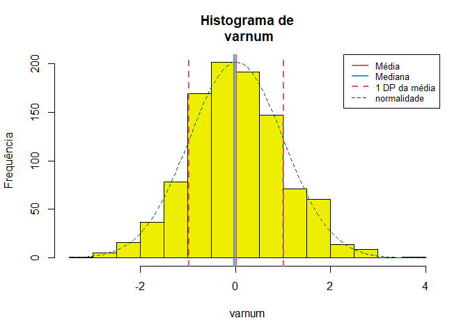

Rcoisas
================

- [Instalação](#instalação)
- [Exemplos](#exemplos)
  - [Descrição univariada](#descrição-univariada)
    - [Variáveis numéricas](#variáveis-numéricas)
    - [Variáveis categóricas](#variáveis-categóricas)
  - [Curva de Nelson de Moraes](#curva-de-nelson-de-moraes)
  - [Tabelas 2 x 2](#tabelas-2-x-2)

<!-- README.md is generated from README.Rmd. Please edit that file -->
<!-- badges: start -->
<!-- badges: end -->

> **Funções em R para aulas e apresentação de resultados em português.**

O pacote contém funções com *outputs* em português e bancos de dados
úteis para a produção de gráficos e tabelas para aulas, como a descrição
“completa” de uma variável numérica, uma tabela de frequências, a
análise de uma tabela 2 x 2 ou a construção de indicadores de saúde,
como a curva de Nelson de Moraes.
<!-- Algumas funções são importadas do pacote [`csapAIH`](https://github.com/fulvionedel/csapAIH) (`fxetar_quinq`, `fxetar3g`, `ufbr`, `ler_popbr` e `popbr2000_2021`).  -->
Veja a ajuda para a lista completa e detalhamento das funções e bancos
de dados no pacote.

# Instalação

O pacote ainda não tem uma primeira versão para ser lançada. A versão de
desenvolvimento pode ser instalada a partir do
[GitHub](https://github.com/) com o pacote `remotes`:

    # install.packages("remotes") # Se o pacote 'remotes' não estiver instalado
    remotes::install_github("fulvionedel/Rcoisas")

# Exemplos

``` r
library(Rcoisas)
```

## Descrição univariada

> Funções `descreve`, `histobox` e `tabuleiro`.

    descreve(x, by = NULL, dec = 2, na.rm = TRUE, data = NULL, histograma = TRUE, breaks = "Sturges", freq = TRUE, main = NULL, xlab = NULL, ylab = NULL, linhas = 2, curva = TRUE, densidade = FALSE, col.dens = 1, col = "yellow2", col.curva = "DarkGreen", col.media = 2, col.dp = col.media, col.mediana = 4, legenda = TRUE, lugar = "topright", lty.curva = 2, lwd.curva = 1, lty.dens = 3, lwd.dens = 2, lty = NULL, lwd = NULL, cex = NULL, print = "output", soma = FALSE, ...)

### Variáveis numéricas

**A função `descreve`** realiza a descrição “completa” de uma variável
numérica. Por padrão apresenta uma lista com os parâmetros descritos e
um histograma com marcas da distribuição da variável. O histograma pode
ser suprimido e a lista pode ser transformada em `data.frame`.

``` r
set.seed(1)
descreve(varnum <- rnorm(1000))  
```


     varnum <- rnorm(1000) :  1000  observações 

    Válidos: 1000    Missings: 0 
    Menor: -3.01     Maior: 3.81     Amplitude: 6.82
    Média: -0.01     DP: 1.03    CV(%): 8884.81
    Assimetria: -0.02    Curtose(real): 2.99
    Quantis:
     2.5%    5%   25%   50%   75%   95% 97.5% 
    -2.13 -1.73 -0.70 -0.04  0.69  1.74  2.01 
              IIQ: 1.39 

``` r

descreve(varnum, histograma = FALSE, print = "tabela")
            varnum
n          1000.00
Válidos    1000.00
Missings      0.00
Menor        -3.01
Maior         3.81
Amplitude     6.82
Média        -0.01
Variância     1.07
DP            1.03
CV(%)      8884.81
Assimetria   -0.02
Curtose       2.99
P2.5         -2.13
P5           -1.73
P25          -0.70
P50          -0.04
P75           0.69
P95           1.74
P97.5         2.01
IIQ           1.39
```

O output pode ser guardado em um objeto e depois impresso como lista ou
como tabela (de classe `data.frame`) e usado para captar em texto cada
parâmetro isoladamente.

``` r
x <- descreve(varnum, histograma = FALSE, print = FALSE)
Rcoisas:::print.descreve(x)

 varnum :  1000  observações 

Válidos: 1000    Missings: 0 
Menor: -3.01     Maior: 3.81     Amplitude: 6.82
Média: -0.01     DP: 1.03    CV(%): 8884.81
Assimetria: -0.02    Curtose(real): 2.99
Quantis:
 2.5%    5%   25%   50%   75%   95% 97.5% 
-2.13 -1.73 -0.70 -0.04  0.69  1.74  2.01 
          IIQ: 1.39 
```

``` r

Rcoisas:::print.descreve(x, print = "tabela")
            varnum
n          1000.00
Válidos    1000.00
Missings      0.00
Menor        -3.01
Maior         3.81
Amplitude     6.82
Média        -0.01
Variância     1.07
DP            1.03
CV(%)      8884.81
Assimetria   -0.02
Curtose       2.99
P2.5         -2.13
P5           -1.73
P25          -0.70
P50          -0.04
P75           0.69
P95           1.74
P97.5         2.01
IIQ           1.39
```

``` r

paste("Média de", x$media, "e desvio-padrão de", x$dp, "unidades, configurando um coeficiente de variação de", x$cv, "%.")
[1] "Média de -0.01 e desvio-padrão de 1.03 unidades, configurando um coeficiente de variação de 8884.81 %."
```

O objeto pode ser modificado para sua impressão. O exemplo a seguir usa
outra função do pacote, `formatL()`, para apresentar os valores em
formato latino.

``` r
Rcoisas:::print.descreve(x, print = "tabela") |> 
  tibble::as_tibble(rownames = "parametro") |>
  dplyr::mutate(varnum = formatL(varnum, format = "fg", digits = 3)) |>
  knitr::kable(align = 'r')
```

|  parametro | varnum |
|-----------:|-------:|
|          n |  1.000 |
|    Válidos |  1.000 |
|   Missings |      0 |
|      Menor |  -3,01 |
|      Maior |   3,81 |
|  Amplitude |   6,82 |
|      Média |  -0,01 |
|  Variância |   1,07 |
|         DP |   1,03 |
|      CV(%) |  8.885 |
| Assimetria |  -0,02 |
|    Curtose |   2,99 |
|       P2.5 |  -2,13 |
|         P5 |  -1,73 |
|        P25 |   -0,7 |
|        P50 |  -0,04 |
|        P75 |   0,69 |
|        P95 |   1,74 |
|      P97.5 |   2,01 |
|        IIQ |   1,39 |

O formato em tabela é pensado para uma análise estratificada por
categorias de um fator. Um argumento `by` está em desenvolvimento e
ainda não funciona adequadamente. 😕 A alternativa é juntar
“manualmente” a descrição de cada estrato:

``` r
par(mfrow = c(1,3))
cbind(
  descreve(idade, data = obitosRS2019[obitosRS2019$sexo == "masc", ], main = "masc", legenda = FALSE, print = 'tabela'),
  descreve(idade, data = obitosRS2019[obitosRS2019$sexo == "fem", ], main = "fem", legenda = FALSE, print = 'tabela'),
  descreve(idade, data = obitosRS2019, main = "ambos sexos", print = 'tabela', lugar = 'topleft')
      ) |>
  dplyr::rename("Masculino" = 1, "Feminino" = 2, "Ambos sexos" = 3) |>
  dplyr::mutate(Masculino = formatL(Masculino, format = "fg", digits = 4),
                Feminino = formatL(Feminino, format = "fg", digits = 4),
                "Ambos sexos" = formatL(`Ambos sexos`, format = "fg", digits = 4)) |>
  knitr::kable(align = 'r') 
```


|            | Masculino | Feminino | Ambos sexos |
|:-----------|----------:|---------:|------------:|
| n          |     5.228 |    4.774 |      10.000 |
| Válidos    |     5.220 |    4.772 |       9.993 |
| Missings   |         8 |        2 |           7 |
| % missings |      0,15 |     0,04 |        0,07 |
| Menor      |         0 |        0 |           0 |
| Maior      |       103 |      112 |         112 |
| Amplitude  |       103 |      112 |         112 |
| Média      |     65,25 |    72,65 |       68,78 |
| Variância  |     388,3 |    355,3 |       386,6 |
| DP         |     19,71 |    18,85 |       19,66 |
| CV(%)      |      30,2 |    25,95 |       28,59 |
| Assimetria |     -1,17 |    -1,49 |       -1,27 |
| Curtose    |      4,46 |     5,93 |        4,91 |
| P2.5       |     13,47 |       21 |          17 |
| P5         |        23 |       37 |          29 |
| P25        |        57 |       64 |          60 |
| P50        |        69 |       77 |          72 |
| P75        |        79 |       86 |          83 |
| P95        |        90 |       94 |          92 |
| P97.5      |        92 |    96,72 |          95 |
| IIQ        |        22 |       22 |          23 |

**A função `histobox`** desenha um histograma com um diagrama de caixas
(“*box-plot*”) horizontal acima do gráfico.

``` r
histobox(varnum, col.h = "tomato", col.bx = "yellow", xlab = "Medida", ylab = "Frequência")
```



### Variáveis categóricas

**As funções `tabuleiro` e `tabuleiro2`** apresentam uma tabela
univariada com frequências absolutas e relativas (%) simples e
acumuladas.

    tabuleiro(x, digits = 1, total = TRUE, cum = TRUE, format = "en", data = NULL, ...)
    tabuleiro2(varcat, digits = 1)

``` r
tabuleiro(RACACOR, data = obitosRS2019)
      Freq     % Freq.acum %acum
1     8514  88.3      8514  88.3
2      567   5.9      9081  94.2
3       10   0.1      9091  94.3
4      534   5.5      9625  99.8
5       17   0.2      9642 100.0
Total 9642 100.0      9642 100.0
```

Uma tabela para apresentação pode ser feita com a função `kable{knitr}`.
Esta função tem argumentos para apresentar resultados em formato latino,
mas o trabalho pode ser abreviado com a função `formatL{Rcoisas}` –
enquanto o argumento `format` não é implementado. Além disso, a
frequência acumulada aqui não faz muito sentido.

``` r
tab1 <- tabuleiro(RACACOR, data = obitosRS2019, cum = FALSE, digits = 3)
knitr::kable(tab1 |> formatL(format = "fg"), align = 'r')
```

|       |   Freq |   % |
|:------|-------:|----:|
| 1     |  8.514 |  88 |
| 2     |    567 |   6 |
| 3     |     10 | 0,1 |
| 4     |    534 |   6 |
| 5     |     17 | 0,2 |
| Total | 10.000 | 100 |

A função foi criada para oferecer axs estudantes um modo fácil de criar
no R uma tabela com essas características e valores em formato latino.
Na sua primeira versão os valores eram pré-formatados, oferecendo a
seguinte tabela:

``` r
(tab2 <- tabuleiro2(obitosRS2019$RACACOR))
              Freq     %(+NA) % válido % acum
1             " 8.514" "85,1" "88,3"   "88,3"
2             "   567" "5,7"  "5,9"    "94,2"
3             "    10" "0,1"  "0,1"    "94,3"
4             "   534" "5,3"  "5,5"    "99,8"
5             "    17" "0,2"  "0,2"    "100" 
Total válidos " 9.642" "96,4" "100"    "˗"   
Missing       "   358" "3,6"  "˗"      "˗"   
Total         "10.000" "100"  "˗"      "˗"   
```

que facilmente pode ser formatada com `kable`.

``` r
knitr::kable(tab2, align = 'r')
```

|               |   Freq | %(+NA) | % válido | % acum |
|:--------------|-------:|-------:|---------:|-------:|
| 1             |  8.514 |   85,1 |     88,3 |   88,3 |
| 2             |    567 |    5,7 |      5,9 |   94,2 |
| 3             |     10 |    0,1 |      0,1 |   94,3 |
| 4             |    534 |    5,3 |      5,5 |   99,8 |
| 5             |     17 |    0,2 |      0,2 |    100 |
| Total válidos |  9.642 |   96,4 |      100 |      ˗ |
| Missing       |    358 |    3,6 |        ˗ |      ˗ |
| Total         | 10.000 |    100 |        ˗ |      ˗ |

Mas os valores da tabela estão em formato caractere e não numérico, o
que impede a execução de operações matemáticas. Por isso foi rebatizada
de `tabuleiro2` e seu desenvolvimento descontinuado. Está no pacote
porque ainda a tenho em várias aulas 😪. É desaconselhável seu uso em
novos scripts.

## Curva de Nelson de Moraes

    fxetarNM(idade = NULL, fxetardet = NULL, grafico = FALSE, ...)

**A função `fxetarNM`** agrega um vetor com a idade ou com a “faixa
etária detalhada” (classificação do DATASUS) segundo as categorias da
Curva de Nelson de Moraes (\< 1, 1-4, 5-19, 20-49, 50 e +). O argumento
`grafico = TRUE` desenha o gráfico da curva.

``` r
fxetarNM(obitosRS2019$idade, grafico = TRUE, 
         col.sub = 2, font.sub = 3, cex.sub = .8, 
         main = "Curva de Nelson de Moraes. RS, 2019.", 
         sub = "\nAmostra aleatória de 10.000 óbitos.") 
```


Neste caso interessam as frequências acumuladas:

``` r
obitosRS2019$idade |>
  fxetarNM() |>
  tabuleiro(total = FALSE) |>
  formatL(format = "fg", digits = 2) |> 
  knitr::kable(align = 'r')
```

|        |  Freq |   % | Freq.acum | %acum |
|:-------|------:|----:|----------:|------:|
| \< 1   |   168 | 1,7 |       168 |   1,7 |
| 1-4    |    25 | 0,3 |       193 |   1,9 |
| 5-19   |   114 | 1,1 |       307 |   3,1 |
| 20-49  | 1.021 |  10 |     1.328 |    13 |
| 50 e + | 8.665 |  87 |    10.000 |   100 |

Veja detalhes sobre a função em
<https://fulvionedel.github.io/Rcoisas/articles/fxetarnm.html>

## Tabelas 2 x 2

**A função `bolero`** analisa a tabela de contingências de duas
variáveis dicotômicas. O exemplo a seguir usa um banco de dados do
pacote Rcoisas, com uma amostra aleatória de dez mil registros de óbitos
do RS para comparar a probabilidade de um diagnóstico de causa
cardiovascular e de causa externa segundo o sexo, entre os óbitos. As
causas são classificadas com a função `cid10cap()`, do pacote
[`csapAIH`](https://github.com/fulvionedel/csapAIH).

``` r
obitos <- obitosRS2019[c("sexo", "idade", "RACACOR", "CAUSABAS")]
cardio <- grepl("circulatório", csapAIH::cid10cap(obitos$CAUSABAS)) |>
  factor(levels = c(TRUE, FALSE), labels = c("sim", "não"))
externas <- grepl("externas", csapAIH::cid10cap(obitos$CAUSABAS)) |>
  factor(levels = c(TRUE, FALSE), labels = c("sim", "não"))

tabolero <- bolero(obitos$sexo, cardio)
===============================================================
                  Tabela 2 por 2 
        bolero(independente, dependente, dec=2, dnn) 
--------------------------------------------------------------- 
Var. dependente : cardio = sim 
Var. independente: obitos.sexo = masc 
Missings: 2 (0,0%)

           cardio
obitos$sexo  sim  não  Sum
       masc 1259 3967 5226
       fem  1311 3461 4772
       Sum  2570 7428 9998

Proporções (%)
           cardio
obitos$sexo  sim  não
       masc 24.1 75.9
       fem  27.5 72.5

Razão de Probabilidades: 0.88 ; IC95% (assintótico): 0.82 0.94 
                                 IC95% (exato)      : 0.82 0.94
Razão de Odds          : 0.84 ; IC95% (exato)      : 0.77 0.92
Valor-p: Pearson, Yates: <0,001 ; Fisher: <0,001 
===============================================================
```

Para mudar a categoria de referência mudam-se antes os níveis da
variável. Os rótulos dos nomes das variáveis podem ser modificados com o
argumento `dnn`.

``` r
bolero(factor(obitos$sexo, levels = c("masc", "fem")), externas, 
       dnn = c("sexo", "causas externas"))
===============================================================
                  Tabela 2 por 2 
        bolero(independente, dependente, dec=2, dnn) 
--------------------------------------------------------------- 
Var. dependente : causas.externas = sim 
Var. independente: sexo = masc 
Missings: 2 (0,0%)

      causas externas
sexo    sim  não  Sum
  masc  634 4592 5226
  fem   221 4551 4772
  Sum   855 9143 9998

Proporções (%)
      causas externas
sexo    sim  não
  masc 12.1 87.9
  fem   4.6 95.4

Razão de Probabilidades: 2.62 ; IC95% (assintótico): 2.26 3.04 
                                 IC95% (exato)      : 2.27 3.02
Razão de Odds          : 2.84 ; IC95% (exato)      : 2.42 3.35
Valor-p: Pearson, Yates: <0,001 ; Fisher: <0,001 
===============================================================
```

`bolero` foi escrita há mais de 20 anos e não pode ser impressa com
`kable`, mas os elementos de seu output podem ser recuperados. Veja a
estrutura de seu resultado:

``` r
# Note que acima foi criado o objeto 'tabolero' 
str(tabolero)
List of 14
 $ tab     : 'table' int [1:2, 1:2] 1259 1311 3967 3461
  ..- attr(*, "dimnames")=List of 2
  .. ..$ obitos$sexo: chr [1:2] "masc" "fem"
  .. ..$ cardio     : chr [1:2] "sim" "não"
 $ proptab : 'table' num [1:2, 1:2] 24.1 27.5 75.9 72.5
  ..- attr(*, "dimnames")=List of 2
  .. ..$ obitos$sexo: chr [1:2] "masc" "fem"
  .. ..$ cardio     : chr [1:2] "sim" "não"
 $ RP      : num 0.877
 $ lci.rp  : num 0.82
 $ uci.rp  : num 0.937
 $ OR      : num 0.838
 $ or.ic   : num [1:2] 0.765 0.917
  ..- attr(*, "conf.level")= num 0.95
 $ lci.or  : num 0.765
 $ uci.or  : num 0.917
 $ ft      :List of 7
  ..$ p.value    : num 0.000118
  ..$ conf.int   : num [1:2] 0.765 0.917
  .. ..- attr(*, "conf.level")= num 0.95
  ..$ estimate   : Named num 0.838
  .. ..- attr(*, "names")= chr "odds ratio"
  ..$ null.value : Named num 1
  .. ..- attr(*, "names")= chr "odds ratio"
  ..$ alternative: chr "two.sided"
  ..$ method     : chr "Fisher's Exact Test for Count Data"
  ..$ data.name  : chr "tab"
  ..- attr(*, "class")= chr "htest"
 $ qui2    :List of 9
  ..$ statistic: Named num 14.8
  .. ..- attr(*, "names")= chr "X-squared"
  ..$ parameter: Named int 1
  .. ..- attr(*, "names")= chr "df"
  ..$ p.value  : num 0.000122
  ..$ method   : chr "Pearson's Chi-squared test with Yates' continuity correction"
  ..$ data.name: chr "tab"
  ..$ observed : 'table' int [1:2, 1:2] 1259 1311 3967 3461
  .. ..- attr(*, "dimnames")=List of 2
  .. .. ..$ obitos$sexo: chr [1:2] "masc" "fem"
  .. .. ..$ cardio     : chr [1:2] "sim" "não"
  ..$ expected : num [1:2, 1:2] 1343 1227 3883 3545
  .. ..- attr(*, "dimnames")=List of 2
  .. .. ..$ obitos$sexo: chr [1:2] "masc" "fem"
  .. .. ..$ cardio     : chr [1:2] "sim" "não"
  ..$ residuals: 'table' num [1:2, 1:2] -2.3 2.41 1.35 -1.42
  .. ..- attr(*, "dimnames")=List of 2
  .. .. ..$ obitos$sexo: chr [1:2] "masc" "fem"
  .. .. ..$ cardio     : chr [1:2] "sim" "não"
  ..$ stdres   : 'table' num [1:2, 1:2] -3.86 3.86 3.86 -3.86
  .. ..- attr(*, "dimnames")=List of 2
  .. .. ..$ obitos$sexo: chr [1:2] "masc" "fem"
  .. .. ..$ cardio     : chr [1:2] "sim" "não"
  ..- attr(*, "class")= chr "htest"
 $ p.qui2  : num 0.000122
 $ p.Fisher: num 0.000118
 $ resumo  : 'table' num [1, 1:4] 0.877 0.82 0.937 0
  ..- attr(*, "dimnames")=List of 2
  .. ..$ : chr "cardio"
  .. ..$ : chr [1:4] "RP" "IC95inf" "IC95sup" "p"
```

Assim podemos dizer, por exemplo, que a probabilidade de que a causa
básica de óbito seja cardiovascular é -12% maior no sexo feminino que no
masculino (RP = 0,88; IC<sub>95</sub> 0,82 a 0,94). Veja abaixo o código
utilizado:

> \[…\] a probabilidade de que a causa básica de óbito seja
> cardiovascular é `` `r formatL((tabolero$RP-1)*100, digits = 0)` ``%
> maior no sexo feminino que no masculino (RP =
> `` `r formatL(tabolero$RP, 2)` ``; IC<sub>95</sub>
> `` `r formatL(tabolero$lci.rp, 2)` `` a
> `` `r formatL(tabolero$uci.rp, 2)` ``).

<!-- You'll still need to render `README.Rmd` regularly, to keep `README.md` up-to-date. `devtools::build_readme()` is handy for this. You could also use GitHub Actions to re-render `README.Rmd` every time you push. An example workflow can be found here: <https://github.com/r-lib/actions/tree/v1/examples>. -->
