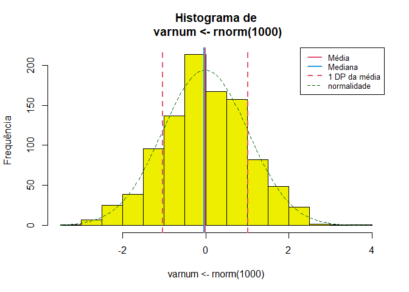

<!-- README.md is generated from README.Rmd. Please edit that file -->

# Rcoisas

badges: start <!-- badges: end -->

> Funções para aulas e apresentação de resultados em português.

O pacote contém 16 funções, incluídas algumas importadas do pacote
[`csapAIH`](https://github.com/fulvionedel/csapAIH)), principalmente
para a descrição de variáveis com ‘output’ em português, e trabalhar com
populações brasileiras .

### Funções no pacote `Rcoisas`

     [1] "POPBR12"                "POPRS2019"              ""                      
     [4] "RDRS2019"               "bolero"                 "descreve"              
     [7] "ed"                     ""                       "formatL"               
    [10] "fxetar.det_pra_fxetar5" ""                       ""                      
    [13] "fxetarNM"               "ggplot_pir"             "histobox"              
    [16] "obitosRS2019"           "plot.histobox"          "plotZ"                 
    [19] ""                       "plot_pir"               ""                      
    [22] "print.descreve"         "tabuleiro"              "tabuleiro2"            

## Instalação

O pacote ainda não tem uma primeira versão para ser lançada. A versão de
desenvolvimento pode ser instalada a partir do
[GitHub](https://github.com/) com:

``` r
# install.packages("remotes") # Se for necessário
remotes::install_github("fulvionedel/Rcoisas")
```

## Exemplos

``` r
library(Rcoisas)
```

### Descrição univariada

Funções `descreve`, `histobox` e `tabuleiro`.

``` r
varnum <- rnorm(1000)
descreve(varnum)
## 
##  varnum :  1000  observações 
## 
## Válidos: 1000     Missings: 0     Soma: -20.39 
## Menor: -3.08  Maior: 3.21     Amplitude: 6.29
## Média: -0.02  DP: 1   CV(%): 4884.89
## Assimetria: 0     Curtose(real): 3.05
## Quantis:
##  2.5%    5%   25%   50%   75%   95% 97.5% 
## -1.96 -1.72 -0.69  0.00  0.65  1.62  1.90 
##        IIQ: 1.35
descreve(varnum, print = "tabela")
```



    ##             varnum
    ## n          1000.00
    ## Válidos    1000.00
    ## Missings      0.00
    ## Menor        -3.08
    ## Maior         3.21
    ## Amplitude     6.29
    ## Soma        -20.39
    ## Média        -0.02
    ## Variância     0.99
    ## DP            1.00
    ## CV(%)      4884.89
    ## Assimetria    0.00
    ## Curtose       3.05
    ## P2.5         -1.96
    ## P5           -1.72
    ## P25          -0.69
    ## P50           0.00
    ## P75           0.65
    ## P95           1.62
    ## P97.5         1.90
    ## IIQ           1.35
    histobox(varnum)


``` r

tabuleiro(obitosRS2019$RACACOR)
##          Freq     % Freq.acum %acum
## Branca    755  88.2       755  88.2
## Indígena    3   0.4       758  88.6
## Parda      57   6.7       815  95.2
## Preta      41   4.8       856 100.0
## Total     856 100.0       856 100.0
tabuleiro2(obitosRS2019$RACACOR)
##               Freq  %(+NA) % válido % acum
## Branca        "755" "84,6" "88,2"   "88,2"
## Indígena      "  3" "0,3"  "0,4"    "88,6"
## Parda         " 57" "6,4"  "6,7"    "95,2"
## Preta         " 41" "4,6"  "4,8"    "100" 
## Total válidos "856" "96,0" "100"    "˗"   
## Missing       " 36" "4,0"  "˗"      "˗"   
## Total         "892" "100"  "˗"      "˗"
```

``` r
temp <- descreve(varnum, print = "tabela") 
```


``` r
temp$x <- formatL(temp$varnum, format = "fg", digits = 3)
temp
##             varnum     x
## n          1000.00 1.000
## Válidos    1000.00 1.000
## Missings      0.00     0
## Menor        -3.08 -3,08
## Maior         3.21  3,21
## Amplitude     6.29  6,29
## Soma        -20.39 -20,4
## Média        -0.02 -0,02
## Variância     0.99  0,99
## DP            1.00     1
## CV(%)      4884.89 4.885
## Assimetria    0.00     0
## Curtose       3.05  3,05
## P2.5         -1.96 -1,96
## P5           -1.72 -1,72
## P25          -0.69 -0,69
## P50           0.00     0
## P75           0.65  0,65
## P95           1.62  1,62
## P97.5         1.90   1,9
## IIQ           1.35  1,35
```

### Tabelas 2 $\times$ 2

``` r
obitos <- obitosRS2019[c("sexo", "idade", "RACACOR", "CAUSABAS")]
cardio <- grepl("circulatório", csapAIH::cid10cap(obitos$CAUSABAS)) |>
  factor(levels = c(TRUE, FALSE), labels = c("sim", "não"))
externas <- grepl("externas", csapAIH::cid10cap(obitos$CAUSABAS)) |>
  factor(levels = c(TRUE, FALSE), labels = c("sim", "não"))

bolero(obitos$sexo, cardio)
## =============================================================
##                   Tabela 2 por 2 
##         bolero(independente, dependente, dec=2, dnn) 
## ------------------------------------------------------------- 
## Var. dependente : cardio = sim 
## Var. independente: obitos.sexo = fem 
## 
##            cardio
## obitos$sexo sim não Sum
##        fem  107 318 425
##        masc 110 357 467
##        Sum  217 675 892
## 
## Proporções (%)
##            cardio
## obitos$sexo  sim  não
##        fem  25.2 74.8
##        masc 23.6 76.4
## 
##   Razão de Probabilidades: 1.07 ; IC95% (assintótico): 0.85 1.35 
##                                   IC95% (exato)      : 0.83 1.34
##   Razão de Odds          : 1.09 ; IC95% (exato)      : 0.79 1.50
##   Valor-p: Pearson, Yates: 0.627 ; Fisher: 0.585 
## =============================================================
bolero(factor(obitos$sexo, levels = c("masc", "fem")), externas, dnn = c("sexo", "causas externas"))
## =============================================================
##                   Tabela 2 por 2 
##         bolero(independente, dependente, dec=2, dnn) 
## ------------------------------------------------------------- 
## Var. dependente : causas.externas = sim 
## Var. independente: sexo = masc 
## 
##       causas externas
## sexo   sim não Sum
##   masc  55 412 467
##   fem    9 416 425
##   Sum   64 828 892
## 
## Proporções (%)
##       causas externas
## sexo    sim  não
##   masc 11.8 88.2
##   fem   2.1 97.9
## 
##   Razão de Probabilidades: 5.56 ; IC95% (assintótico): 2.78 11.11 
##                                   IC95% (exato)      : 2.85 11.20
##   Razão de Odds          : 6.17 ; IC95% (exato)      : 2.97 14.37
##   Valor-p: Pearson, Yates: <0,001 ; Fisher: <0,001 
## =============================================================
```

badges: end

<!-- You'll still need to render `README.Rmd` regularly, to keep `README.md` up-to-date. `devtools::build_readme()` is handy for this. You could also use GitHub Actions to re-render `README.Rmd` every time you push. An example workflow can be found here: <https://github.com/r-lib/actions/tree/v1/examples>. -->
