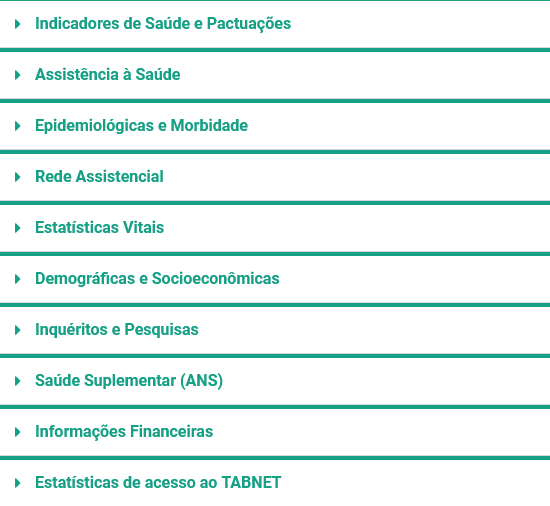
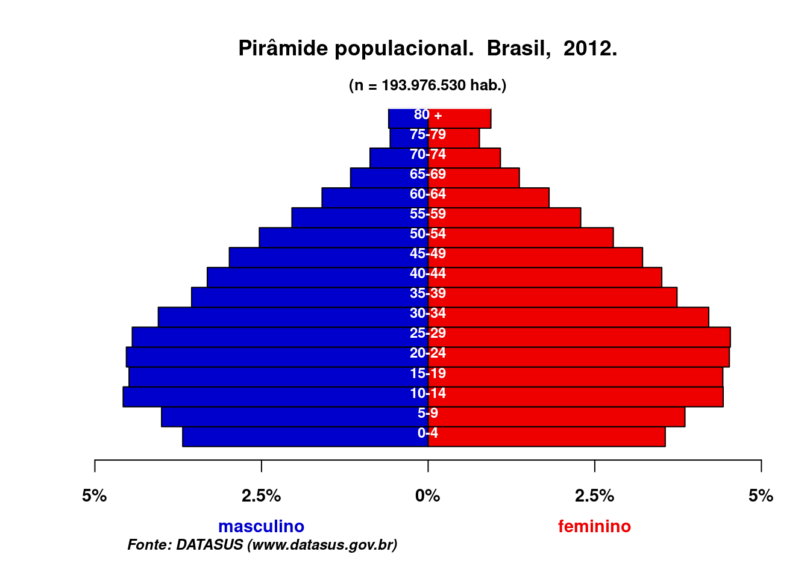
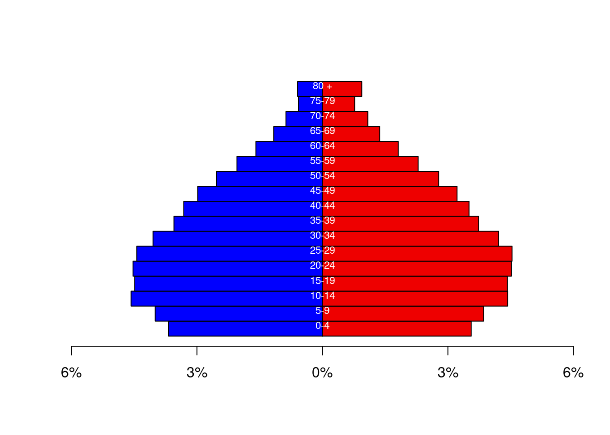
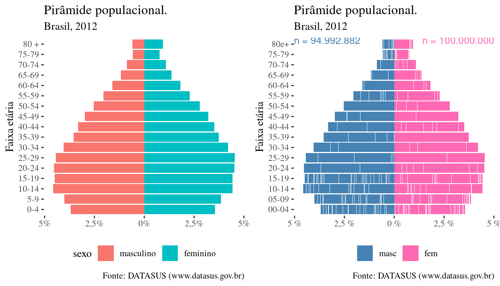
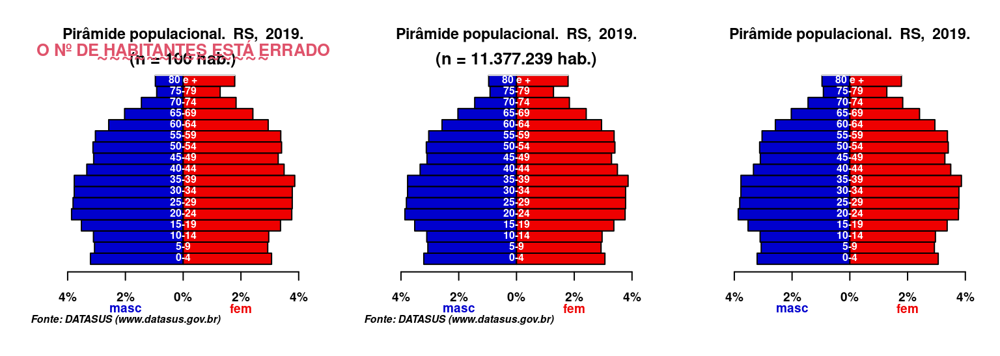

# Pirâmides populacionais

``` r
# Para facilitar a construção deste artigo, alguns pacotes são carregados desde o início:
library(Rcoisas)
library(dplyr)
library(ggplot2)
```

O gráfico da estrutura demográfica de uma população, isto é, da
distribuição proporcional dos habitantes por faixa etária e sexo, é
chamado *pirâmide populacional* ou *pirâmide etária*, porque em seus
primeiros desenhos – em fases primitivas da Transição Demográfica – as
sociedades apresentam um desenho similar a uma pirâmide, de base larga e
estreitando-se a cada faixa etária até um ápice adelgaçado. O gráfico é
uma oposição de dois gráficos de barras horizontais, um para cada sexo,
da frequência relativa de cada faixa etária e sexo específicos sobre o
total da população. Na transição demográfica, com a diminuição dos
nascimentos e aumento da expectativa de vida da população, a figura vai
mudando sua forma de pirâmide para um barril, tendendo a uma pirâmide de
base invertida.

Assim, a pirâmide nos dá muito rapidamente uma noção da fase da
transição demográfica em que se encontra uma população. Gráficos de base
larga representam populuações “jovens”, com alta natalidade e baixa
expectativa de vida, e gráficos de base estreita e ápice alargado
representam populações em fase avançada da transição demográfica, com
baixa natalidade e alta expectativa de vida. A Figura [1](#fig:palegre)
mostra a estrutura etária de Porto Alegre, capital do RS, quando eu
fazia o ensino secundário, um ano depois de terminar o doutorado e
agora. De outro modo, mas junto com a gente, a cidade também envelhece.


Figura 1: Pirâmide populacional de Porto Alegre, RS, em 1980, 2010 e
2020.

## Censos, estimativas e a necessidade de cadastramento da população residente

Não é objetivo deste breve artigo focado no uso do pacote Rcoisas para
desenhar pirâmides populacionais, discorrer sobre a realização de censos
e cadastramentos populacionais, menos ainda sobre o cálculo de
estimativas intercensitárias. Mas, mormente quando esse uso é
particularmente voltado aos arquivos de dados voltado às informações
disponibilizadas pelo DATASUS, é importante lembrar algumas coisas:

- Desde antes do Estado Moderno (e de Graunt, “pai” da demografia)
  sabemos da importância da contagem populacional e o conhecimento de
  suas características para o planejamento de ações públicas.
  Atualmente, espera-se que um país faça um censo a cada década, com uma
  contagem populacional cinco anos após o censo, de modo que tenha dados
  empíricos e atualização de estimativas a cada cinco anos.

- Não é fácil estimar o número de habitantes de uma população pequena ou
  muito dinâmica e agradecer muito ao DATASUS e sexs trabalhadorxs pela
  realização desses cálculos e disponibilização das estimativas por sexo
  e faixa etária para os municípios brasileiros. Na grande maioria dos
  casos, estamos falando de populações muito pequenas, cuja quantidade
  se pretende estimar para dois sexos e 17 faixas etárias diferentes.

- O que, por sua vez, coloca à mesa a utilidade do cadastramento
  populacional da população, como o que **se espera e pode** ser feito
  na Estratégia Saúde da Família do SUS[¹](#fn1).

## O TABNET e os arquivos de população do DATASUS

O [TABNET](https://datasus.saude.gov.br/informacoes-de-saude-tabnet/) é
um aplicativo de tabulação de dados de diferentes Sistemas de Informação
em Saúde brasileiros e outras informações relacionadas, como contagens e
projeções intercensitárias por sexo e faixa etária da população
residente nos municípios. No item sobre informações [“Demográficas e
Socioeconômicas”](https://datasus.saude.gov.br/populacao-residente)
(Figura [2](#fig:tabnet)) podem-se tabular informações de censos,
contagens e estimativas populacionais para os municípios desde 1980 até
2021. No entanto, em função de diferenças metodológias nas estimativas,
a informação é disponíbilizada para dois períodos diferentes: *1980 a
2012* e *2000 a 2021* (a primeira e a última opções da Figura
[3](#fig:datasus)).



Figura 2: Informações disponíveis no TABNET.

Mais importante neste caso em que se quer uma função que automatize a
construção do gráfico, é a forma com que se distribui a informação:

- *1980 a 2012*: além das tabulações possíveis no TABNET (e download das
  tabelas resultantes), há, para cada ano, arquivos em formato .dbf e
  csv com a população por sexo e faixa etária por município para todo o
  país, distribuídos pelo DATASUS em arquivos zipados; os arquivos podem
  ser obtidos através da página de download de [arquivos do
  DATASUS](https://datasus.saude.gov.br/transferencia-de-arquivos/) ou
  pelo endereço do site FTP:
  <ftp://ftp.datasus.gov.br/dissemin/publicos/IBGE/POP/>
- *2000 a 2021*: só a tabulação e download da tabela resultante é
  possível, os arquivos-fonte não estão disponíveis.


Figura 3: As opções de tabulação de população no TABNET/DATASUS.

Em sua página de [transferência de
arquivos](https://datasus.saude.gov.br/transferencia-de-arquivos/), o
DATASUS disponibiliza os arquivos de população (contagens e estimativas)
por sexo e faixa etária para os municípios brasileiros para os anos 1980
a 2012. Nessa página estão disponíveis a maioria dos arquivos-fonte das
tabulações disponíveis no
[TABNET](https://datasus.saude.gov.br/populacao-residente) e nesse
sentido as contagens e estimativas populacionais eram tratadas como as
informações de internação hospitalar ou óbito, em que os arquivos-fonte
são disponbilizados para download ao estarem disponíveis no TABNET as
opções de tabulação.

Depois experimentamos um período em que já tínhamos dados dos Sistemas
de Informação em Saúde mas nos faltavam estimativas populacionais
adequadas para os denominadores. Uma alternativa foi usar as estimativas
populacionais calculadas para o Tribunal de Contas da União – que podiam
então ser tabuladas no TABNET por sexo e faixa etária, o que não é mais
o caso –, apesar dos avisos de sua inadequação para o cálculo de
indicadores de saúde. Felizmente, em seguida foi possível utilizar os
dados do [Estudo de Estimativas Populacionais por Município, sexo e
idade -
2000-2021](http://tabnet.datasus.gov.br/cgi/deftohtm.exe?ibge/cnv/popsvsbr.def).
Atualmente, a [Nota
Técnica](http://tabnet.datasus.gov.br/cgi/IBGE/SEI_MS-0034745983-Nota_Tecnica_final.pdf)
da [página de
tabulação](http://tabnet.datasus.gov.br/cgi/deftohtm.exe?ibge/cnv/popsvsbr.def)
avisa que ao ver os dados do censo de 2022, percebeu-se uma
superestimação dos números absolutos nessas estimativas, mas não dá
informação sobre variação relativa entre as faixas etárias.

De qualquer forma, *no momento isso é passado* :D. Logo teremos os dados
do Censo 2022 e projeções atualizadas `=^.^=`

## Funções em Rcoisas: `plot_pir` e `ggplot_pir`

O desenho da pirâmide etária é útil para a descrição de uma população.
Se geralmente não há espaço para a sua publicação nos artigos limitados
em cinco elementos gráficos (tabelas e figuras), é por outro lado fácil
inseri-lo em diapositivos de apresentação de trabalhos, posters,
relatórios de pesquisa e documentos como os Planos Municipais de Saúde
do SUS. Mas a construção do gráfico é bastante trabalhosa, o que motivou
o desenvolvimento de uma função que automatizasse a leitura de dados e
produção do gráfico, já que então não encontrei pacotes ou funções do R
voltadas a esse fim. Atualmente há alguns pacotes especializados que
merecem ser vistos, como
[popPyramid](https://github.com/musajajorge/popPyramid),
[pyramid](https://cran.r-project.org/web/packages/pyramid/index.html) e
[apyramid](https://cran.r-project.org/web/packages/apyramid/vignettes/intro.html).

    plot_pir(pop, tabela = FALSE, ano = NULL, local = "população", title = NULL, 
             npop = NULL, fontsize = 1.1, axes = FALSE, fonte = NULL, x.lim = NULL, 
             colmasc = "mediumblue", colfem = "red2", colfxetar = "white", 
             border = par("fg"), inside = T, drop.unused.levels = FALSE, ...)

    ggplot_pir(banco, idade, sexo, populacao = NULL, catsexo = c("masc", "fem"),
               cores = c("steelblue", "hotpink"), nsize = 3.5)

As funções
[`plot_pir()`](https://fulvionedel.github.io/Rcoisas/reference/plot_pir.md)
e
[`ggplot_pir()`](https://fulvionedel.github.io/Rcoisas/reference/ggplot_pir.md)
de `Rcoisas` geram gráficos de pirâmide populacional. O pacote tem duas
funções para um mesmo fim, em alguns aspectos bastante diferentes entre
si, porque foram construídas de acordo com os dados disponíveis para
tabulação.
[`plot_pir()`](https://fulvionedel.github.io/Rcoisas/reference/plot_pir.md)
foi criada para ler os arquivos de população do DATASUS e gerar um
gráfico pronto para publicação, com facilidades para gerar o título e
mínimas necessidades de editoração (e de possibilidades de
ajuste).[²](#fn2) A interrupção da publicação desses arquivos revelou a
necessidade de uma função mais flexível na entrada de dados.
[`ggplot_pir()`](https://fulvionedel.github.io/Rcoisas/reference/ggplot_pir.md)
atende a essa necessidade; além disso, é construída com `ggplot2`, o que
permite a reutilização do gráfico e o uso das demais funções do pacote,
além de facilitar o salvamento da figura. Em compensação, exige sempre
alguma editoração antes de publicar o gráfico.

## Exemplos

### Arquivos de população do DATASUS, de 1980 a 2012.

O pacote Rcoisas tem incorporado o banco de dados “POPBR12”
([`?POPBR12`](https://fulvionedel.github.io/Rcoisas/reference/POPBR12.md))
com as estimativas populacionais por sexo e faixa etária para os
municípios brasileiros em 2012, armazenado no arquivo
[“POPBR12.zip”](ftp://ftp.datasus.gov.br/dissemin/publicos/IBGE/POP/POPBR12.zip),
que pode ser baixado na página de [“transferência de
arquivos”](https://datasus.saude.gov.br/transferencia-de-arquivos/) do
DATASUS.

Vamos usá-lo, sua estrutura é a seguinte:

``` r
data("POPBR12")
str(POPBR12)
  'data.frame': 367290 obs. of  6 variables:
   $ MUNIC_RES: int  110001 110001 110001 110001 110001 110001 110001 110001 110001 110001 ...
   $ ANO      : int  2012 2012 2012 2012 2012 2012 2012 2012 2012 2012 ...
   $ SEXO     : int  1 1 1 1 1 1 1 1 1 1 ...
   $ SITUACAO : int  3 3 3 3 3 3 3 3 3 3 ...
   $ FXETARIA : int  0 101 202 303 404 505 606 707 808 909 ...
   $ POPULACAO: int  187 186 187 190 193 198 204 211 219 226 ...
```

Note que todas as variáveis estão em formato numérico, e a faixa etária
está categorizada segundo a “faixa etária detalhada” do DATASUS, isto,
é, faixas anuais até os 19 anos, quinquenais dos 20 a 79 anos e aberta a
partir de então (80 e mais anos de idade).

Essa estrutura é esperada por
[`plot_pir()`](https://fulvionedel.github.io/Rcoisas/reference/plot_pir.md):

``` r
graf_base <- plot_pir(POPBR12, local = "Brasil") 
  Input object size:     8816320 bytes;  6 variables     367290 observations
  New object size:  8816320 bytes;  6 variables 367290 observations
```



Mas não por
[`ggplot_pir()`](https://fulvionedel.github.io/Rcoisas/reference/ggplot_pir.md),
que espera a faixa etária em 17 categorias (quinquenais até 79 anos, 80
e mais) e o sexo como um fator, exigindo portanto a modificação prévia
do banco de dados. Além disso os títulos e rótulos devem ser criados ou
formatados em comandos adicionais:

``` r
graf_gg <- POPBR12 %>% 
  mutate(SEXO = factor(SEXO, labels = c("masc", "fem")),
         FXETAR5 = fxetar.det_pra_fxetar5(FXETARIA)) %>% 
  ggplot_pir(idade = "FXETAR5", sexo = "SEXO", populacao = "POPULACAO") +
  labs(title = "Pirâmide populacional.",
       subtitle = "Brasil, 2012",
       caption = "Fonte: DATASUS (www.datasus.gov.br)") +
  xlab("Faixa etária")
graf_gg
```


Note ainda que direcionamos o resultado de `plot_pir` a um objeto (de
nome `graf_base`), mas mesmo assim o output foi apresentado em tela, sem
comando adicional, diferente de `ggplot_pir`, cujo output só é
apresentado depois de chamarmos `graf_gg`. Por outro lado, ao chamarmos
`graf_base`, vemos que ele contém apenas a tabela com os dados (um *data
frame* com as variáveis “masculino” e “feminino” e 17 registros em
linhas com os nomes das faixas etárias, sem o gráfico). Logicamente, a
tabela pode ser representada em gráfico, como vemos abaixo, mas exige
algum trabalho. Utilizando `ggplot2` os gráficos podem ser criados como
objetos, podendo ser reaproveitados, além de uma grande capacidade de
editoração da figura. Essa é uma vantagem de
[`ggplot_pir()`](https://fulvionedel.github.io/Rcoisas/reference/ggplot_pir.md).

O objeto resultante de
[`plot_pir()`](https://fulvionedel.github.io/Rcoisas/reference/plot_pir.md):

``` r
str(graf_base)
  'data.frame': 17 obs. of  2 variables:
   $ masculino: int  7143389 7758474 8875967 8704999 8782606 8610952 7853458 6883541 6427350 5785459 ...
   $ feminino : int  6901204 7474673 8587202 8577046 8766636 8795610 8166586 7243527 6800153 6240934 ...
rownames(graf_base)
   [1] "0-4"   "5-9"   "10-14" "15-19" "20-24" "25-29" "30-34" "35-39" "40-44"
  [10] "45-49" "50-54" "55-59" "60-64" "65-69" "70-74" "75-79" "80 +"
graf_base
        masculino feminino
  0-4     7143389  6901204
  5-9     7758474  7474673
  10-14   8875967  8587202
  15-19   8704999  8577046
  20-24   8782606  8766636
  25-29   8610952  8795610
  30-34   7853458  8166586
  35-39   6883541  7243527
  40-44   6427350  6800153
  45-49   5785459  6240934
  50-54   4912910  5389329
  55-59   3963556  4441120
  60-64   3087312  3520063
  65-69   2256975  2654866
  70-74   1691406  2103802
  75-79   1105881  1493580
  80 +    1148647  1827317
```

As porcentagens podem ser facilmente calculadas, enquanto o gráfico
exige algum trabalho. O que
[`plot_pir()`](https://fulvionedel.github.io/Rcoisas/reference/plot_pir.md)
faz é basicamente o seguinte:

``` r
# porcentagens no sexo masculino
pm <- graf_base$masculino/sum(graf_base$masculino + graf_base$feminino)*100
# porcentagens no sexo feminino
pf <- graf_base$feminino/sum(graf_base$masculino + graf_base$feminino)*100

par(xpd=NA)
barplot(-pm, horiz = T, col = "blue", xlim = c(-6,6), space = 0, axes = F)
barplot(pf, horiz = T, add = T, col = "red2", xlim = c(-6,6), space = 0, axes = F)
axis(side = 1, at = seq(-6, 6, by=3), labels = paste(c(6, 3, 0, 3, 6), "%", sep=""))
text(x = 0, y = seq(1:17), labels=row.names(graf_base), adj=c(0.5,1), cex =.7, col = "white")
```



Claro que o banco pode ser trabalhado com `dplyr` e o gráfico pode ser
desenhado com `ggplot2`, como os de
[`ggplot_pir()`](https://fulvionedel.github.io/Rcoisas/reference/ggplot_pir.md):

``` r
graf_ggbase <- graf_base %>% 
  mutate(fxetar = rownames(.) |> factor(levels = rownames(.))) %>% 
  tidyr::pivot_longer(1:2, names_to = 'sexo', values_to = 'n') %>% 
  mutate(sexo = factor(sexo, levels = c('masculino', 'feminino'))) %>% 
  mutate(perc = n/sum(n)*100) %>% 
  mutate(perc = if_else(sexo == 'masculino', perc*-1, perc)) %>% 
  ggplot(aes(fxetar, perc, group = sexo, fill = sexo)) +
  geom_col() +
  xlab("Faixa etária") +
  ylab(NULL) +
  lemon::scale_y_symmetric(labels = function(x) paste0(formatL(abs(x), 2, format = "fg"), "%")) +
  coord_flip() +
  labs(title = "Pirâmide populacional.",
       subtitle = "Brasil, 2012",
       caption = "Fonte: DATASUS (www.datasus.gov.br)") 

gridExtra::grid.arrange(graf_ggbase +
                          ggthemes::theme_tufte() +
                          theme(legend.position = 'bottom'),
                        graf_gg +
                          ggthemes::theme_tufte() +
                          theme(legend.position = 'bottom'),
                        nrow = 1)
```



### Outros dados de população

O pacote `Rcoisas` tem também um banco de dados com as estimativas
populacionais dos municípios gaúchos para 2019. Vemos abaixo sua
estrutura, a população aparece como uma variável de contagem.

Como a variável indicadora do sexo é um fator com as categorias `masc` e
`fem`, é muito fácil desenhar a pirâmide com
[`ggplot_pir()`](https://fulvionedel.github.io/Rcoisas/reference/ggplot_pir.md),
devemos apenas indicar os nomes das variáveis com a faixa etária, o sexo
e a população. Se as categorias forem outras, como “masculino” e
“feminino”, basta usar o argumento
`catsexo = c("masculino", "feminino")`.

``` r
data("POPRS2019")
str(POPRS2019)
  'data.frame': 16898 obs. of  8 variables:
   $ CO_UF   : chr  "43" "43" "43" "43" ...
   $ UF_SIGLA: Factor w/ 1 level "RS": 1 1 1 1 1 1 1 1 1 1 ...
   $ REGIAO  : Factor w/ 1 level "S": 1 1 1 1 1 1 1 1 1 1 ...
   $ ano     : num  2019 2019 2019 2019 2019 ...
   $ mun     : chr  "430003" "430003" "430003" "430003" ...
   $ sexo    : Factor w/ 2 levels "masc","fem": 1 1 1 1 1 1 1 1 1 1 ...
   $ fxetar5 : Factor w/ 17 levels "0-4","5-9","10-14",..: 1 2 3 4 5 6 7 8 9 10 ...
   $ pop     : int  174 160 138 169 206 193 179 191 181 204 ...
ggplot_pir(POPRS2019, idade = 'fxetar5', sexo = 'sexo', populacao = 'pop')
```


Já
[`plot_pir()`](https://fulvionedel.github.io/Rcoisas/reference/plot_pir.md)
agora exige manejo prévio dos dados, pois não consegue ler o “data
frame” em outro formato que o trabalhado anteriormente. Nesse caso
pode-se criar uma tabela com a faixa etária nas linhas e o sexo em duas
colunas e usar o argumento `tabela = TRUE`:

``` r
# Cria uma tabela com o nº de habitantes por sexo e faixa etária
tabpop <- POPRS2019 %>% 
  summarise(pop = sum(pop), .by = c(sexo, fxetar5)) %>% 
  tidyr::pivot_wider(id_cols = 'fxetar5', names_from = sexo, values_from = pop) %>% 
  data.frame(row.names = 'fxetar5')
str(tabpop)
  'data.frame': 17 obs. of  2 variables:
   $ masc: int  365227 349212 353453 401011 439741 433799 429164 429006 379716 352646 ...
   $ fem : int  348273 333116 337222 383527 427864 429768 429868 439625 397617 374416 ...
```

``` r
plot_pir(tabpop, tabela = T, local = "RS", ano = 2019) 
```


Para o (eventual) caso de se tabular uma tabela com as proporções ou
porcentagens, deve-se modificar o argumento `npop` (que imprime um
subtítulo com a soma da população), pois automaticamente somará 1 ou
100, respectivamente. Se o número total da população é conhecido,
pode-se colocar ali a informação, através de texto ou uma função. Se a
informação é desconhecida, pode-se definir `npop = FALSE` para suprimir
o texto. O mesmo pode ser feito com a nota ao pé do gráfico, que
responde ao argumento `fonte`. Vemos aqui um exemplo:

``` r
# Cria uma tabela com a porcentagem de habitantes por sexo e faixa etária
tabprop <- POPRS2019 %>% 
  summarise(pop = sum(pop), .by = c(sexo, fxetar5)) %>% 
  mutate(perc = pop/sum(pop)*100) %>%
  tidyr::pivot_wider(id_cols = 'fxetar5', names_from = sexo, values_from = perc) %>% 
  data.frame(row.names = 'fxetar5')
str(tabprop)
  'data.frame': 17 obs. of  2 variables:
   $ masc: num  3.21 3.07 3.11 3.52 3.87 ...
   $ fem : num  3.06 2.93 2.96 3.37 3.76 ...
```

``` r
par(mfrow = c(1,3))
plot_pir(tabprop, tabela = T, local = "RS", ano = 2019) 
mtext("O Nº DE HABITANTES ESTÁ ERRADO", line = .5, col = 2, font = 2, type = 4, cex = .8)  
mtext("~~~~~~~~~~~~~~", line = -.1, col = 2, font = 2, type = 2)
plot_pir(tabprop, tabela = T, local = "RS", ano = 2019, npop = sum(POPRS2019$pop))
plot_pir(tabprop, tabela = T, local = "RS", ano = 2019, fonte = F, npop = F)
```



## Enfim:

- `plot_pir`
  - produz um gráfico mais elaborado e pronto para impressão;
  - está construída para os arquivos de população do DATASUS do período
    1980-2012, mas trabalhando em estrutura de tabela funciona com
    qualquer ano ou local;
  - o gráfico é produzido com as funções básicas do R e portanto não é
    salvo ao ser destinado a um objeto; é salva apenas uma tabela (na
    classe `data.frame`) com os valores por sexo e faixa etária;
    - logicamente, isso é suficiente para gerar um gráfico com qualidade
      de apresentação.
- `ggplot_pir`
  - o gráfico pode ser produzido sobre qualquer conjunto de informações
    de sexo e faixa etária;
    - pode assim ser usado para a representação de faixas etárias por
      sexo em dados de mortalidade, hospitalização e outros;
  - gera um gráfico de classe `ggplot`, que pode ser destinado a um
    objeto e reutilizado;
  - a publicação exige alguma personalização prévia;
  - é facilmente personalizável.
- em ambas funções
  - o gráfico é de porcentagens, sem possibilidade de que apresente
    números absolutos;
  - o sexo masculino vai à esquerda e o sexo feminino à direita;
  - as cores das barras são livremente configuráveis: meninas e meninos
    vestem-se como bem entenderem.

## *Addendum*

### Um aplicativo *shiny* com `plot_pir()`

A função foi utilizada na em um aplicativo shiny para a construção
on-line de pirâmides de municípios, unidades da federação e todo o
Brasil em anos selecionados, acessível em
<https://fulvionedel.shinyapps.io/teste-piramide/>.

### Uma função para a “faixa etária detalhada”

`fxetar.det_pra_fxetar5(x, tipo = "POPBR")`

Quem trabalha bastante com o TabWin ou TABNET seguido tem arquivos (em
formato .csv, .tab ou .xls, .xlsx) com tabelas da população ou outras
com os casos classificados em “faixa etária detalhada”. A função
[`fxetar.det_pra_fxetar5()`](https://fulvionedel.github.io/Rcoisas/reference/fxetar.det_pra_fxetar5.md)
reclassifica as idades \< 20 anos em faixas etárias quinquenais, criando
uma variável com faixas etárias quinquenais (0-4, … 75-79, 80+).

## Agradecimentos

A todes que publicam tutoriais, artigos e funções no
[Rpubs](https://rpubs.com/) e [R-bloggers](https://www.r-bloggers.com/),
que fazem e respondem perguntas no
[stackoverflow](https://stackoverflow.com/), desenvolvedores do RStudio,
`tidyverse`, etc. Enfim, a toda a comunidade do R.

------------------------------------------------------------------------

1.  Nosso *Sistema Único de Saúde*, se o leitor não conhece a sigla.

2.  Foi usada para um [aplicativo
    *shiny*](https://fulvionedel.shinyapps.io/teste-piramide/), com
    alguns anos de exemplo.
