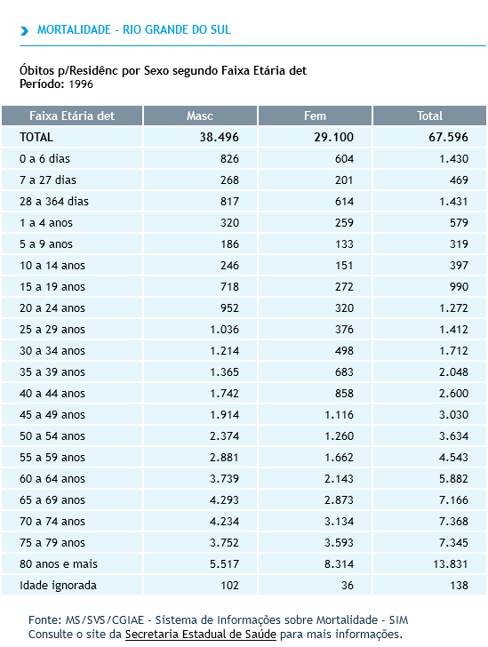

```{r, include = FALSE}
knitr::opts_chunk$set(
  fig.height = 5,
  fig.align = 'center',
  message = FALSE,
  collapse = TRUE,
  comment = "  "
)
```

```{r setup}
library(Rcoisas)
library(dplyr)
```

A *Curva de Nelson de Moraes* é o desenho da distribuição proporcional da idade da morte em cinco faixas etárias, a saber: `r fxetarNM()[1:4]` e `r fxetarNM()[5]` anos de idade. Leva o nome do sanitarista brasileiro que a idealizou, em 1959, para avaliar o grau de desenvolvimento de uma população. Uma curva em $J$, com baixa mortalidade em menores de um ano e a grande maioria da população morrendo após os 50 anos de idade, indica o maior grau de desenvolvimento entre os quatro níveis de classificação (Figura \@ref(fig:niveis)).

Esse indicador tem grande capacidade descritiva em estágios menos avançados das transições demográfica e epidemiológica e é muito interessante acompanhar, por exemplo, sua evolução no Brasil desde a era Vargas, ou de cidades brasileiras nos registros de mortalidade. Entretanto, tem menor capacidade de identificar diferenças onde elas acontecem após os 50 anos de idade. E convenhamos que considerar 50 anos como limite de idade para a morte em populações com nível de saúde "elevado" é, no mínimo, anacrônico.

Outra característica que pode ser apontada como fortaleza é que, ao ser um indicador de mortalidade proporcional, não exige o conhecimento de estimativas populacionais, apenas o Sistema de Informação de Mortalidade. Novamente aqui vê-se a pátina da anacronia, entrado o século XXI não se pode mais pensar numa sociedade democrática que não realize censos. Assim, deve-se lembrar que isso é também uma limitação do indicador, pois não mede o risco de morte a cada idade, apenas a carga da morte em cada faixa etária considerada. Além disso -- logicamente, por ser a proporção sobre o total de mortes -- o valor alcançado em cada faixa etária depende também da quantidade de mortes em cada uma das demais faixas etárias. 

```{r niveis, echo=FALSE, fig.cap="Níveis de saúde de uma população segundo a Curva de Nelson de Moraes.", results='hide', out.width="100%"}
muitobaixo <- c(rep(0,20), rep(2,10), rep(10, 5), rep(25, 35), rep(55, 30))
baixo <- c(rep(0,50), rep(2,15), rep(10, 7), rep(25, 10), rep(55, 18))
regular <- c(rep(0,25), rep(2,10), rep(10, 5), rep(25, 20), rep(55, 40))
elevado <- c(rep(0,7), rep(2,2), rep(10, 1), rep(25, 10), rep(55, 80))

par(mfrow = c(2,2))
fxetarNM(muitobaixo, grafico = T, main = "Muito baixo")
fxetarNM(baixo, grafico = T, main = "Baixo")
fxetarNM(regular, grafico = T, main = "Regular")
fxetarNM(elevado, grafico = T, main = "Elevado")
```

## A função `fxetarNM()`

`fxetarNM()` classifica a idade segundo as faixas de Nelson de Moraes e devolve um fator com cada registro classificado. Assim, esse vetor pode ser incluído como variável em um banco de dados ou manejado e apresentado em tabelas e gráficos.

Além disso, em seu uso mais simples, a função retorna as faixas etárias consideradas:

```{r}
fxetarNM()
```

O objetivo desse comportamento é facilitar a construção de material didático e relatórios de análise. Mais acima, por exemplo, para citar as faixas etárias, dizendo que são "`r fxetarNM()[1:4]` e `r fxetarNM()[5]`", foi escrito "`'r fxetarNM()[1:4]'` e `'r fxetarNM()[5]'`"

Ainda no sentido de facilitar a produção de material didático no R, é fácil desenhar a curva de acordo com níveis teóricos da distribuição. Por exemplo, a Figura \@ref(fig:niveis) foi construída com o código abaixo, que gera para cada um dos quatro níveis de saúde ("muito baixo" a "elevado"), um vetor com 100 registros de valores fictícios de idade (0, 2, 10, 25, 55) que serão classificados nas faixas etárias. A distribuição proporcional se dá pelo número de repetições solicitadas (no nível "muito baixo", 20% das mortes em \< 1 ano, 10% aos 2, 5% aos 10, 35% aos 25 e 30% aos 55). Para desenhar o gráfico, usa-se o argumento `grafico = TRUE`.

```         
muitobaixo <- c(rep(0,20), rep(2,10), rep(10, 5), rep(25, 35), rep(55, 30))
baixo <- c(rep(0,50), rep(2,15), rep(10, 7), rep(25, 10), rep(55, 18))
regular <- c(rep(0,25), rep(2,10), rep(10, 5), rep(25, 20), rep(55, 40))
elevado <- c(rep(0,7), rep(2,2), rep(10, 1), rep(25, 10), rep(55, 80))

par(mfrow = c(2,2))
fxetarNM(muitobaixo, grafico = T, main = "Muito baixo")
fxetarNM(baixo, grafico = T, main = "Baixo")
fxetarNM(regular, grafico = T, main = "Regular")
fxetarNM(elevado, grafico = T, main = "Elevado")
```

### Trabalhando com um banco de dados

Usaremos o banco de dados "obitosRS2019", do próprio pacote Rcoisas. Esse banco é uma amostra aleatória dos registros de mortalidade do RS em 2019, com um trabalho _post-hoc_ de decodificação e rotulagem de variáveis (v. `?obitosRS2019`)   .

```{r}
data(obitosRS2019)
```

É bastante simples gerar um gráfico e tabela de frequências da curva com qualidade de publicação (Figura \@ref(fig:grafuncao) e Tabela \@ref(tab:grafuncao)). No exemplo abaixo, os resultados são salvos em um objeto ("tabela", da classe `factor`) para depois serem impressos. Note que o gráfico é desenhado com as funções básicas do R para esse fim e, portanto, é de classe `NULL` e não pode ser salvo como objeto para reprodução.

```{r grafuncao, fig.align='center', out.width="60%", fig.cap="Curva de Nelson de Moraes. Desenho com o argumento 'grafico' da função."}
fxetarNM(obitosRS2019$idade, grafico = T, 
         main = "Curva de Nelson de Moreaes. RS, 2019.*",
         sub = paste("* Amostra aleatória de", 
                     formatL(nrow(obitosRS2019), format = "fg"), 
                     "casos."),
         col.sub = "red", font.sub = 4, 
         family = "sans") |>
  tabuleiro() |>
  kableExtra::kbl(caption = "Tabulando os resultados para apresentação.", 
                  format.args = list(big.mark = ".", decimal.mark = ","))
```

Para uma análise em mais dimensões, por exemplo a curva por sexo (Figura \@ref(fig:detalhe) e Tabela \@ref(tab:detalhe)), mantenha o argumento `grafico = FALSE` e use as funções do R para uma descrição condicionada por outras variáveis. Penso que o mais útil é incluir o fator resultante da função como uma variável no banco de dados em análise. O código a seguir faz isso através de `mutate(fxetarnm = fxetarNM(idade))`. Note que, uma vez que em nenhum dos dois momentos as ações realizadas sobre `obitosRS2019` são destinadas a um objeto, essas mudanças são temporárias.

```{r detalhe, out.width="60%", fig.align='center', fig.cap="Para uma análise com mais dimensões, mantenha o argumento 'grafico = FALSE' em `fxetarNM` e grafique o vetor com um pacote especializado, como  'ggplot2'."}
obitosRS2019 %>%  
  filter(!is.na(idade), !is.na(sexo)) %>%
  mutate(fxetarnm = fxetarNM(idade)) %>% 
  group_by(sexo, fxetarnm) %>%
  count() %>% 
  ungroup(fxetarnm) %>%
  mutate(perc = n/sum(n)*100,
         perc = formatL(perc),
         n = formatL(n, format = 'fg')) %>%
  ungroup() %>%
  tidyr::pivot_wider(names_from = sexo, values_from = c(n, perc)) %>% 
  relocate(n_masc, .before = n_fem) %>% 
  relocate(perc_masc, .after = n_masc) %>% 
  kableExtra::kbl(align = 'r',
                  caption = "Uma tabela mais detalhada: distribuição por sexo.", 
                  col.names = c("Faixa etária", rep(c("n", "%"), 2))) %>% 
  kableExtra::add_header_above(c("", "Masculino" = 2, "Feminino" = 2)) %>%
  kableExtra::add_header_above(c("", "Sexo" = 4))

library(ggplot2)
obitosRS2019 %>% 
  filter(!is.na(idade), !is.na(sexo)) %>%
  mutate(fxetar = fxetarNM(idade)) %>% 
  ggplot(aes(fxetar, y = after_stat(prop), group = sexo, colour = sexo)) +
  geom_line(stat = 'count') +
  scale_y_continuous(labels=scales::percent) +
  labs(title = "Curva de Nelson de Moraes.",
       subtitle = "RS 2019, distribuição por sexo.*",
       caption = "*Amostra aleatória de 10.000 registros.") +
  xlab("Faixa etária") +
  ylab("Proporção de mortes") +
  ggthemes::theme_wsj(base_size = 10)
```


### Trabalhando com tabelas

Se o objeto for uma tabela com faixas etárias que possam ser agrupadas segundo as categorias de Nelson de Moraes, como uma tabela com a "faixa etária detalhada" do DATASUS, por exemplo (Figura \@ref(fig:datasus)), pode-se tabular com `xtabs()`.

```{r datasus, out.width="50%", fig.cap="Uma tabela com a 'faixa etária detalhada'.", echo=FALSE}

```

A tabela da Figura \@ref(fig:datasus) poderia ser salva num arquivo csv e então lida no R da seguinte maneira (entre outras):

```{r}
tabela <- read.csv2("../../data-raw/obitosRS1996.csv", skip = 3, nrows = 20)
tabela
```

Um gráfico com a Curva de Nelson de Moraes por sexo pode então ser conseguido da seguinte forma (para maior clareza das etapas, as porcentagens calculadas foram previamente guardadas em vetores):

```{r, fig.cap='O gráfico a partir de uma tabela com a "faixa etária detalhada".'}
pnmfem <- xtabs(Fem/sum(Fem)*100 ~ fxetarNM(fxetardet = tabela$Faixa.Etaria.det), data = tabela)
pnmmasc <- xtabs(Masc/sum(Masc)*100 ~ fxetarNM(fxetardet = tabela$Faixa.Etaria.det), data = tabela)

limys <- c(0, 80)
plot(pnmfem, type = 'l', ylim = limys, ylab = "% de óbitos", xlab = "Faixa etária", col = 2, main = "Curva de Nelson de Moraes, por sexo. RS, 1996.")
par(new = TRUE)
plot(pnmmasc, type = 'l', ylab = "", xlab = "", col = 4, axes = F, ylim = limys)
legend(1, 80, legend = c("Masculino", "Feminino"), col = c(4,2), lty = 1, bty = "n")
```

